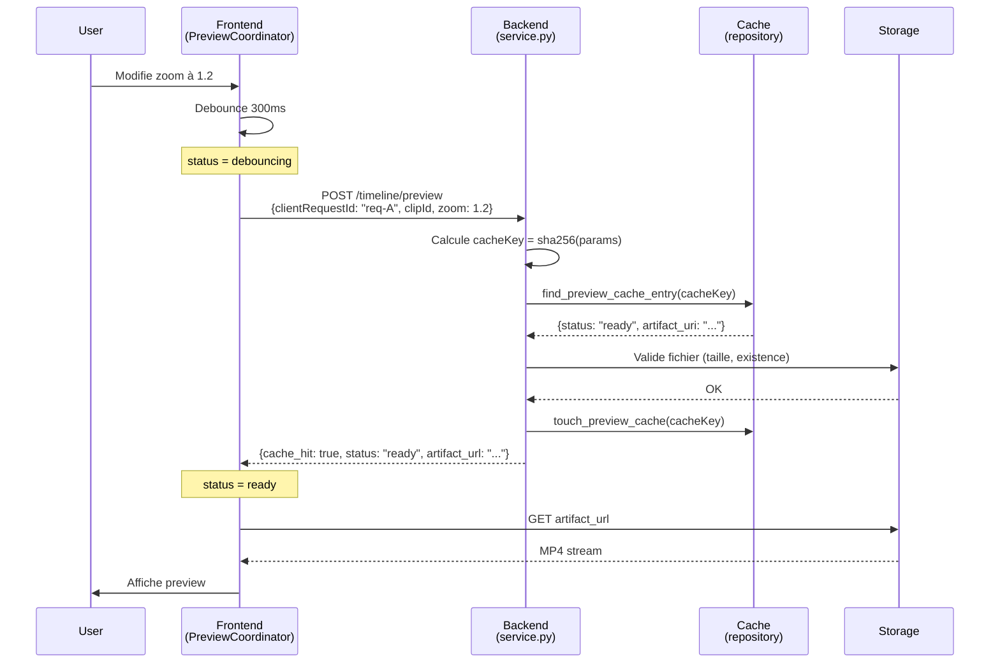
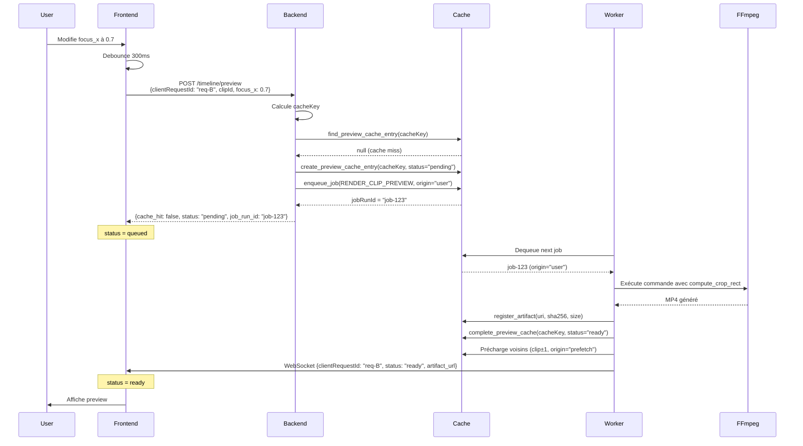
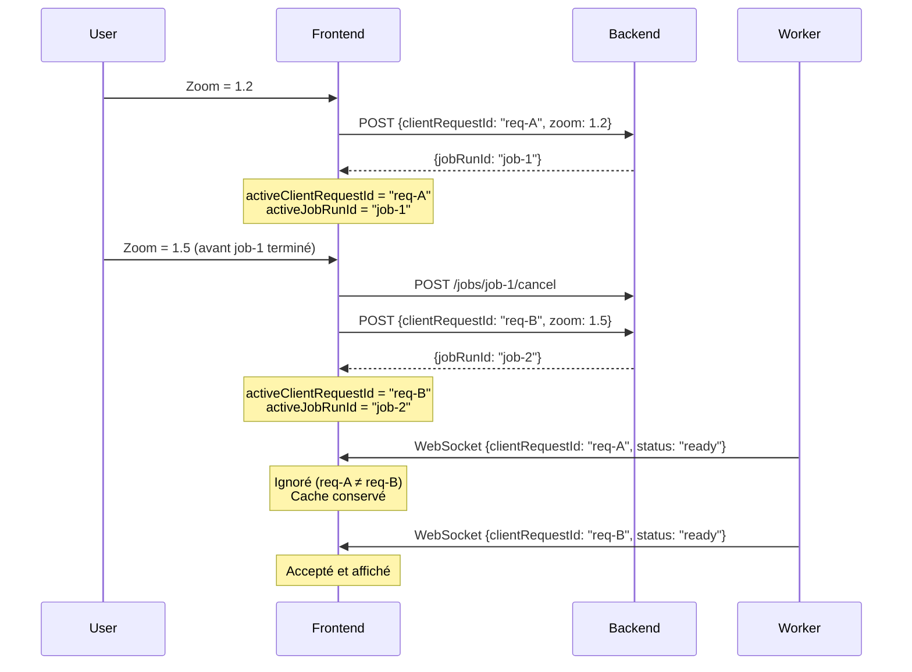
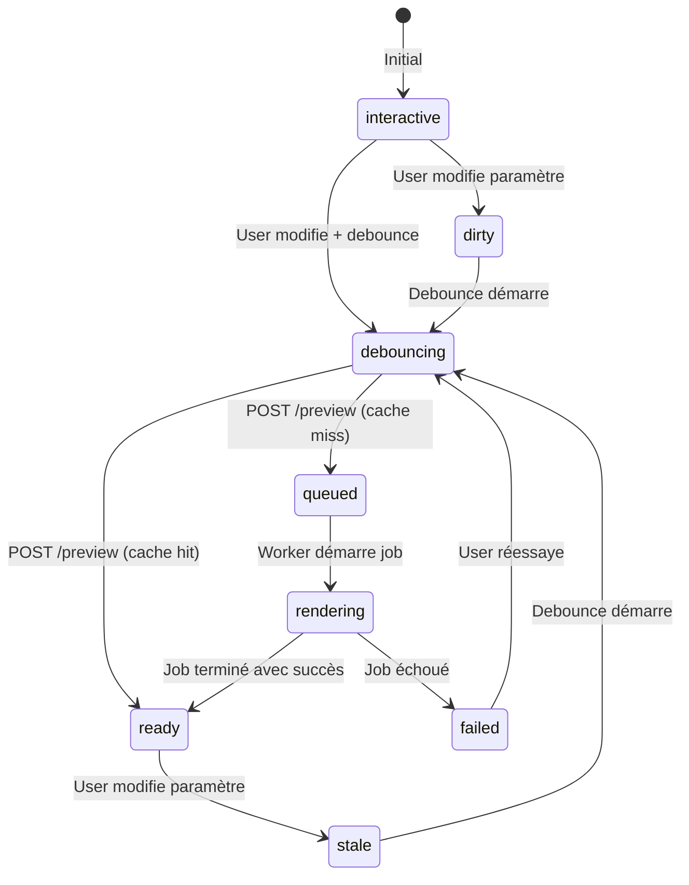
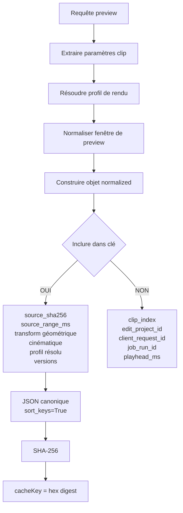
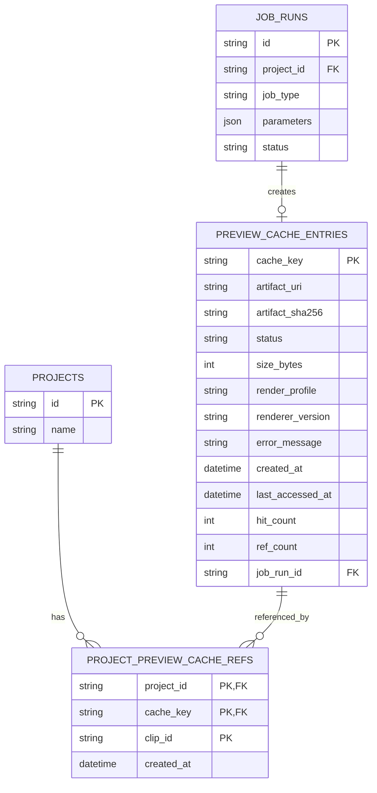

# Moteur de Prévisualisation Instantanée — Spécification 0.8.0

## Table des matières
1. [Résumé exécutif](#résumé-exécutif)
2. [Architecture générale](#architecture-générale)
3. [Identifiants et isolation des concepts](#identifiants-et-isolation-des-concepts)
4. [Composants détaillés](#composants-détaillés)
5. [Diagrammes et flux](#diagrammes-et-flux)
6. [Performance et métriques](#performance-et-métriques)
7. [Plan de vérification](#plan-de-vérification)
8. [Plan d'implémentation](#plan-dimplémentation)

---

## Résumé exécutif

Ce plan transforme l'éditeur de timeline en un environnement de montage fluide grâce à **trois niveaux de prévisualisation** avec des garanties de latence croissantes :

| Niveau | Latence cible (P95) | Quand | Comment |
|--------|---------------------|-------|---------|
| **A — Interactif** | < 16,7 ms par frame (60 fps), interaction P95 < 100 ms | Pendant que l'utilisateur glisse un slider | Transformations CSS/Canvas sur le proxy, aucun appel FFmpeg |
| **B — Draft encodé** | < 3 s (extrait 3 s, 540×960) | Après 300 ms d'inactivité | FFmpeg `ultrafast` CRF 28, fenêtre courte autour du playhead |
| **C — Fidélité finale** | < 8 s (extrait 2 s, résolution finale) | Bouton explicite | Paramètres résolus du rendu final, extrait court |

### Correctifs majeurs de la v0.8.0

| # | Problème v0.7 | Solution v0.8 |
|---|---------------|---------------|
| **1** | Réponse API retourne `Project` complet | `PreviewResponse` dédiée avec `clientRequestId`, `jobRunId`, `cacheKey` |
| **2** | Clips identifiés par `clip_index` (position) | UUID stable `clip_id` — survit aux réorganisations |
| **3** | Cache lié au projet via FK cascade | Cache global + table de jonction — partage inter-projets |
| **4** | Clé de cache omet résolution/codec | Clé SHA-256 du profil **entièrement résolu** |
| **5** | Préchargement récursif illimité | `job_origin` — seul `user` précharge, `prefetch` ne propage pas |
| **6** | Divergence CSS/FFmpeg sur le crop | Contrat canonique `compute_crop_rect` partagé Python/TypeScript |

---

## Architecture générale

```text
┌─────────────────────────────────────────────────────────────────────┐
│                          EDITING STUDIO                              │
├─────────────────────────────────────────────────────────────────────┤
│                                                                       │
│  ┌───────────────────────────────────────────────────────────────┐  │
│  │         InteractivePreviewEngine (Niveau A)                   │  │
│  │  • <video> proxy player synchronisé avec playhead             │  │
│  │  • CSS transform calculée depuis NormalizedTransform          │  │
│  │  • Canvas 2D overlay (crop handles, rectangle source)         │  │
│  │  • Mode comparaison avant/après avec master/follower sync     │  │
│  │  • ⚡ Latence : < 16,7 ms/frame, interaction < 100 ms          │  │
│  └───────────────────────────────────────────────────────────────┘  │
│                              ▲                                        │
│                              │ proxyUrl, clip params                 │
│                              │                                        │
│  ┌───────────────────────────────────────────────────────────────┐  │
│  │              PreviewCoordinator                               │  │
│  │  • Debounce 300 ms après dernière modification                │  │
│  │  • clientRequestId monotone (latest-request-wins)             │  │
│  │  • Annulation via jobRunId                                    │  │
│  │  • États : interactive → dirty → debouncing → queued →        │  │
│  │             rendering → ready → stale → failed                │  │
│  │  • Rétention de la dernière preview valide pendant re-rendu   │  │
│  └───────────────────────────────────────────────────────────────┘  │
│                              │                                        │
│                              │ POST /timeline/preview                │
│                              ▼                                        │
└─────────────────────────────────────────────────────────────────────┘
                               │
                               │ HTTP
                               ▼
┌─────────────────────────────────────────────────────────────────────┐
│                    BACKEND PREVIEW SERVICE                           │
├─────────────────────────────────────────────────────────────────────┤
│                                                                       │
│  ┌───────────────────────────────────────────────────────────────┐  │
│  │   start_clip_preview (service.py)                             │  │
│  │   1. Validation révision timeline/clip                        │  │
│  │   2. Résolution du clip par clip_id stable                    │  │
│  │   3. Résolution du profil (draft/fidelity)                    │  │
│  │   4. Calcul clé de cache SHA-256 déterministe                 │  │
│  │   5. Cache hit ? → retour immédiat                            │  │
│  │   6. Job déjà en cours ? → retour status                      │  │
│  │   7. Nouveau job → enqueue + création entrée cache            │  │
│  └───────────────────────────────────────────────────────────────┘  │
│                              │                                        │
│                              ▼                                        │
│  ┌───────────────────────────────────────────────────────────────┐  │
│  │   _render_clip_preview (service.py)                           │  │
│  │   1. FFmpeg avec profil résolu                                │  │
│  │   2. Conversion fenêtre temps sortie → temps source           │  │
│  │   3. Application compute_crop_rect canonique                  │  │
│  │   4. Écriture atomique (.partial → rename)                    │  │
│  │   5. Enregistrement artefact + cache ready                    │  │
│  │   6. Préchargement voisins (si origin=user)                   │  │
│  └───────────────────────────────────────────────────────────────┘  │
│                              │                                        │
│                              ▼                                        │
│  ┌───────────────────────────────────────────────────────────────┐  │
│  │   Cache Management                                            │  │
│  │   • Cache global multi-projets                                │  │
│  │   • Table de jonction project_preview_cache_refs              │  │
│  │   • ref_count pour protection cascade                         │  │
│  │   • LRU avec protection artefacts actifs                      │  │
│  │   • Validation cache hit (taille, probe léger)                │  │
│  └───────────────────────────────────────────────────────────────┘  │
│                                                                       │
└─────────────────────────────────────────────────────────────────────┘
```

---

## Identifiants et isolation des concepts

Le système manipule **quatre identités indépendantes** qu'il ne faut **jamais** confondre :

| Identifiant | Créé par | Portée | Rôle | Format | Stabilité |
|-------------|----------|--------|------|--------|-----------|
| `clientRequestId` | Frontend (`PreviewCoordinator`) | Requête utilisateur | Relie demande → réponse. Politique **latest-request-wins** | UUID v7 | Monotone croissant par session |
| `jobRunId` | Backend (`repository.enqueue_job`) | Job persistant | Identifie la tâche FFmpeg. Cible de `POST /jobs/{jobRunId}/cancel` | UUID v7 | Unique par exécution |
| `cacheKey` | Backend (`_preview_cache_key`) | Cache déterministe | SHA-256 des paramètres de rendu normalisés. Stable entre projets | SHA-256 (64 hex) | Déterministe, stable |
| `artifactId` | Backend (`register_artifact`) | Artefact MP4 | Réfère le fichier physique produit. Lié au cache via `artifact_uri` | UUID v7 | Unique par fichier |

### Règles d'utilisation critiques

> [!IMPORTANT]
> - **Annulation** : cible toujours `jobRunId`, jamais `clientRequestId`
> - **Cache** : indexé par `cacheKey`, jamais par `clipIndex` ni `editProjectId`
> - **Validation fraîcheur** : frontend valide par `clientRequestId`, jamais par `jobRunId`
> - **Déduplication** : backend déduplique par `cacheKey`, pas par paramètres bruts

### Flux de vie des identifiants

```text
USER ACTION (drag slider)
    ↓
Frontend génère clientRequestId = "req-001" (UUID v7)
    ↓
POST /timeline/preview { clientRequestId: "req-001", ... }
    ↓
Backend calcule cacheKey = sha256(normalized_params)
    ↓
Cache miss → enqueue job
    ↓
Backend génère jobRunId = "job-abc" (UUID v7)
    ↓
Response { clientRequestId: "req-001", jobRunId: "job-abc", cacheKey: "0x..." }
    ↓
Frontend stocke activeClientRequestId = "req-001", activeJobRunId = "job-abc"
    ↓
USER MODIFIES (nouveau drag)
    ↓
Frontend génère clientRequestId = "req-002"
    ↓
Frontend annule POST /jobs/job-abc/cancel (via jobRunId ancien)
    ↓
Nouveau POST avec "req-002"
    ↓
Job "job-abc" termine → artefact créé avec artifactId = "art-xyz"
    ↓
WebSocket notification { clientRequestId: "req-001", ... }
    ↓
Frontend rejette (req-001 ≠ req-002) mais cache conservé
    ↓
Job "req-002" termine → Frontend accepte et affiche
```

---

## Composants détaillés

### Composant 1 : Identité stable des clips

#### Problème résolu (Correction #2)
Le contrat actuel identifie les clips par `clip_index` (position ordinale dans le tableau `clips`). Si l'utilisateur réorganise la timeline, un index change de sens entre la demande et l'exécution du job.

**Scénario problématique** :
```text
1. Timeline : [clip A (index=0), clip B (index=1), clip C (index=2)]
2. User demande preview du clip B (index=1)
3. Request envoyée : { clip_index: 1 }
4. Pendant le rendu, user réorganise : [clip C, clip A, clip B]
5. Job FFmpeg s'exécute avec clip_index=1 → rend clip A au lieu de B
```

#### [MODIFY] `types.ts`
Ajout d'un `id` stable (UUID v7) à `AdvancedEditingClip` :

```typescript
export interface AdvancedEditingClip {
  id: string;             // UUID v7 — identité stable du clip
  index: number;          // position d'affichage, pas d'identité métier
  start_ms: number;
  end_ms: number;
  reframe_mode: ReframeMode;
  focus_start_x: number;
  focus_end_x: number;
  focus_y: number;
  zoom: number;
  speed: number;
  fade_in_ms: number | null;
  fade_out_ms: number | null;
  comparison: ComparisonConfig | null;
}
```

Et ajout au `TimelineRevisionRequest` :
```typescript
export interface TimelineRevisionRequest {
  base_edit_project_id: string;
  expected_revision: number;
  clips: AdvancedEditingClip[];   // chaque clip porte son id
  overlays: EditableOverlay[];
  note: string;
}
```

#### [MODIFY] `editing_intelligence.py`
Dans `build_advanced_edit_plan`, chaque clip reçoit déjà un `uuid7()` via `build_timeline` dans `production.py`. S'assurer que ce champ `id` est exposé dans le JSON de l'`AdvancedEditingState` et persiste à travers les révisions.

```python
# Dans build_timeline (production.py)
clip_data = {
    "id": uuid7(),  # ← déjà présent, vérifier l'exposition
    "index": idx,
    "start_ms": int(clip.start_ms),
    "end_ms": int(clip.end_ms),
    # ...
}
```

#### [MODIFY] `service.py` — `save_timeline_revision`
Lors d'une sauvegarde de révision, si un clip entrant n'a pas de champ `id`, en générer un. Si le clip est un duplicata d'un clip existant (mêmes `start_ms`/`end_ms` dans la révision parente), conserver son `id` d'origine. L'`index` reste recalculé à la position dans le tableau.

```python
def save_timeline_revision(
    self, project_id: str, request: TimelineRevisionRequest,
) -> dict[str, Any]:
    # ... validation ...
    
    # Normaliser les clips : garantir que chaque clip a un id
    parent_clips = dict(parent_revision.get("clips", []))
    normalized_clips = []
    
    for idx, clip_data in enumerate(request.clips):
        clip = dict(clip_data)
        clip["index"] = idx
        
        # Si pas d'id, chercher dans le parent ou générer
        if "id" not in clip or not clip["id"]:
            # Chercher correspondance dans parent par start_ms/end_ms
            match = next(
                (c for c in parent_clips 
                 if c["start_ms"] == clip["start_ms"] 
                 and c["end_ms"] == clip["end_ms"]),
                None
            )
            clip["id"] = match["id"] if match else str(uuid7())
        
        normalized_clips.append(clip)
    
    # ... reste de la sauvegarde ...
```

---

### Composant 2 : Contrat API Preview (Correction #1)

#### Problème résolu
La v0.7 retournait un objet `Project` complet (plusieurs Mo), incluant des données non pertinentes pour la preview. Cela causait :
- Bande passante excessive
- Parsing JSON coûteux côté frontend
- Difficulté à extraire les identifiants critiques (`jobRunId`, `cacheKey`)

#### [MODIFY] `models.py`

**Requête structurée** :
```python
class PreviewWindowRequest(ApiModel):
    """Fenêtre de temps à rendre (temps de sortie du clip)."""
    playhead_ms: int = Field(ge=0, description="Position actuelle de lecture")
    duration_ms: int = Field(
        ge=500, le=10_000, default=3000,
        description="Durée à rendre (3s draft, 2s fidelity max)"
    )

class ClipPreviewRequest(ApiModel):
    """Demande de preview pour un clip spécifique."""
    client_request_id: str = Field(
        min_length=36, max_length=36,
        description="UUID v7 créé par le frontend pour la règle latest-request-wins",
    )
    edit_project_id: str = Field(min_length=36, max_length=36)
    clip_id: str = Field(
        min_length=36, max_length=36,
        description="Identité stable du clip (UUID), pas sa position",
    )
    timeline_revision: int = Field(
        ge=0,
        description="Numéro de révision attendu — rejet si la timeline a changé",
    )
    clip_revision: int = Field(
        ge=0, default=0,
        description="Incrément local du clip pour détecter les modifications concurrentes",
    )
    render_profile: Literal["draft", "fidelity"] = "draft"
    preview_window: PreviewWindowRequest | None = Field(
        default=None,
        description="Fenêtre limitée autour du playhead. None = clip complet (hors SLA)"
    )
```

**Réponse dédiée** :
```python
class PreviewResponse(ApiModel):
    """Réponse compacte pour une demande de preview."""
    client_request_id: str
    job_run_id: str | None = Field(
        default=None,
        description="ID du job FFmpeg. Null si cache hit immédiat"
    )
    cache_key: str = Field(description="Clé SHA-256 du cache")
    cache_hit: bool
    status: Literal["ready", "pending", "rendering", "failed"]
    artifact_url: str | None = Field(
        default=None,
        description="URL de téléchargement de l'artefact MP4 si status=ready"
    )
    clip_id: str
    clip_revision: int
    timeline_revision: int
    render_profile: Literal["draft", "fidelity"]
    error_message: str | None = None
```

#### [MODIFY] `main.py` — route `render_clip_preview`
```python
@app.post(
    "/api/v1/projects/{project_id}/timeline/preview",
    status_code=202,
    response_model=PreviewResponse,
)
async def render_clip_preview(
    project_id: str,
    request: ClipPreviewRequest,
) -> PreviewResponse:
    """
    Demande de preview pour un clip spécifique.
    
    Retourne immédiatement avec :
    - status=ready + artifact_url si cache hit
    - status=pending/rendering + job_run_id sinon
    
    Le frontend poll via WebSocket ou GET /jobs/{job_run_id}
    """
    return service.start_clip_preview(project_id, request)
```

#### [MODIFY] `api.ts`
```typescript
export interface PreviewResponse {
  client_request_id: string;
  job_run_id: string | null;
  cache_key: string;
  cache_hit: boolean;
  status: "ready" | "pending" | "rendering" | "failed";
  artifact_url: string | null;
  clip_id: string;
  clip_revision: number;
  timeline_revision: number;
  render_profile: "draft" | "fidelity";
  error_message?: string;
}

export interface PreviewWindow {
  playheadMs: number;
  durationMs: number;
}

// Dans l'objet api
renderClipPreview: (
  projectId: string,
  params: {
    clientRequestId: string;
    editProjectId: string;
    clipId: string;
    timelineRevision: number;
    clipRevision: number;
    renderProfile: "draft" | "fidelity";
    previewWindow: PreviewWindow | null;
  },
): Promise<PreviewResponse> =>
  request(`/api/v1/projects/${projectId}/timeline/preview`, {
    method: "POST",
    body: JSON.stringify({
      client_request_id: params.clientRequestId,
      edit_project_id: params.editProjectId,
      clip_id: params.clipId,
      timeline_revision: params.timelineRevision,
      clip_revision: params.clipRevision,
      render_profile: params.renderProfile,
      preview_window: params.previewWindow,
    }),
  }),
```

---

### Composant 3 : Prévisualisation interactive frontend (Niveau A)

#### Architecture du composant

Le Niveau A offre un retour visuel instantané pendant l'interaction, **sans aucun appel réseau ni encodage**. Il repose sur trois piliers techniques :

1. **Transformations CSS** : `scale` + `translate` calculées depuis `NormalizedTransform`
2. **Canvas overlay** : rectangle de crop, poignées, réticule de focus
3. **Synchronisation vidéo** : `currentTime` du proxy aligné sur `playheadMs`

#### [NEW] `InteractivePreview.tsx`

```typescript
interface InteractivePreviewProps {
  proxyUrl: string;              // URL du proxy 540×960 ou 720×1280
  clip: AdvancedEditingClip;     // paramètres du clip
  playheadMs: number;            // position dans le clip (temps sortie)
  clipDurationMs: number;        // durée totale du clip
  viewMode: "cropped" | "before_after";
  outputWidth: number;           // 540 ou 720
  outputHeight: number;          // 960 ou 1280
  onFocusChange?: (focusX: number, focusY: number) => void;
  onZoomChange?: (zoom: number) => void;
}

export function InteractivePreview({
  proxyUrl,
  clip,
  playheadMs,
  clipDurationMs,
  viewMode,
  outputWidth,
  outputHeight,
  onFocusChange,
  onZoomChange,
}: InteractivePreviewProps) {
  const videoRef = useRef<HTMLVideoElement>(null);
  const canvasRef = useRef<HTMLCanvasElement>(null);
  const [isDragging, setIsDragging] = useState(false);
  const [proxyMetadata, setProxyMetadata] = useState<{
    width: number;
    height: number;
  } | null>(null);

  // Charger métadonnées du proxy
  useEffect(() => {
    const video = videoRef.current;
    if (!video) return;
    
    const handleLoadedMetadata = () => {
      setProxyMetadata({
        width: video.videoWidth,
        height: video.videoHeight,
      });
    };
    
    video.addEventListener("loadedmetadata", handleLoadedMetadata);
    return () => video.removeEventListener("loadedmetadata", handleLoadedMetadata);
  }, [proxyUrl]);

  // Synchroniser currentTime avec playheadMs
  useEffect(() => {
    const video = videoRef.current;
    if (!video || !proxyMetadata) return;
    
    const targetTime = (playheadMs / 1000);
    const currentTime = video.currentTime;
    
    // Correction uniquement si dérive > 40ms
    if (Math.abs(currentTime - targetTime) > 0.04) {
      video.currentTime = targetTime;
    }
  }, [playheadMs, proxyMetadata]);

  // Calculer la transformation CSS
  const transform = useMemo(() => {
    if (!proxyMetadata) return null;
    
    // Interpoler focus_x si animation
    const progress = Math.min(playheadMs / clipDurationMs, 1);
    const currentFocusX = 
      clip.focus_start_x + 
      (clip.focus_end_x - clip.focus_start_x) * progress;
    
    const cropRect = computeCropRect(
      proxyMetadata.width,
      proxyMetadata.height,
      outputWidth,
      outputHeight,
      currentFocusX,
      clip.focus_y,
      clip.zoom,
    );
    
    const scaleX = 1 / cropRect.cropWidth;
    const scaleY = 1 / cropRect.cropHeight;
    const translateX = -cropRect.cropX * proxyMetadata.width;
    const translateY = -cropRect.cropY * proxyMetadata.height;
    
    return {
      cropRect,
      style: {
        transformOrigin: "0 0",
        transform: `scale(${scaleX}, ${scaleY}) translate(${translateX}px, ${translateY}px)`,
      },
    };
  }, [
    proxyMetadata,
    clip.focus_start_x,
    clip.focus_end_x,
    clip.focus_y,
    clip.zoom,
    playheadMs,
    clipDurationMs,
    outputWidth,
    outputHeight,
  ]);

  // Dessiner l'overlay Canvas
  useEffect(() => {
    const canvas = canvasRef.current;
    if (!canvas || !transform || !proxyMetadata) return;
    
    const ctx = canvas.getContext("2d");
    if (!ctx) return;
    
    ctx.clearRect(0, 0, outputWidth, outputHeight);
    
    // Rectangle de crop
    ctx.strokeStyle = "rgba(0, 255, 200, 0.8)";
    ctx.lineWidth = 2;
    ctx.strokeRect(0, 0, outputWidth, outputHeight);
    
    // Réticule de focus
    const progress = Math.min(playheadMs / clipDurationMs, 1);
    const currentFocusX = 
      clip.focus_start_x + 
      (clip.focus_end_x - clip.focus_start_x) * progress;
    
    const focusScreenX = currentFocusX * outputWidth;
    const focusScreenY = clip.focus_y * outputHeight;
    
    ctx.strokeStyle = "rgba(255, 255, 0, 0.6)";
    ctx.lineWidth = 1;
    ctx.beginPath();
    ctx.moveTo(focusScreenX - 10, focusScreenY);
    ctx.lineTo(focusScreenX + 10, focusScreenY);
    ctx.moveTo(focusScreenX, focusScreenY - 10);
    ctx.lineTo(focusScreenX, focusScreenY + 10);
    ctx.stroke();
    
  }, [transform, proxyMetadata, playheadMs, clipDurationMs, clip, outputWidth, outputHeight]);

  if (viewMode === "before_after") {
    return <BeforeAfterView {...{ proxyUrl, clip, playheadMs, outputWidth, outputHeight }} />;
  }

  return (
    <div 
      className="interactive-preview"
      style={{
        position: "relative",
        width: outputWidth,
        height: outputHeight,
        overflow: "hidden",
        backgroundColor: "#000",
      }}
    >
      <video
        ref={videoRef}
        src={proxyUrl}
        style={transform?.style}
        muted
        playsInline
      />
      <canvas
        ref={canvasRef}
        width={outputWidth}
        height={outputHeight}
        style={{
          position: "absolute",
          top: 0,
          left: 0,
          pointerEvents: isDragging ? "none" : "auto",
        }}
      />
    </div>
  );
}
```

#### Comparaison avant/après — synchronisation correcte

Le mode avant/après nécessite deux lecteurs vidéo synchronisés. La stratégie naïve (réassigner `currentTime` à chaque frame) provoque des micro-seeks et du double-décodage.

**Stratégie optimale** :
```typescript
function BeforeAfterView({
  proxyUrl,
  clip,
  playheadMs,
  outputWidth,
  outputHeight,
}: {
  proxyUrl: string;
  clip: AdvancedEditingClip;
  playheadMs: number;
  outputWidth: number;
  outputHeight: number;
}) {
  const masterRef = useRef<HTMLVideoElement>(null);
  const followerRef = useRef<HTMLVideoElement>(null);
  const [separatorX, setSeparatorX] = useState(outputWidth / 2);
  
  // Synchronisation master → follower
  useEffect(() => {
    const master = masterRef.current;
    const follower = followerRef.current;
    if (!master || !follower) return;
    
    let rafId: number;
    
    const sync = () => {
      const drift = Math.abs(master.currentTime - follower.currentTime);
      
      // Correction uniquement si dérive > 40ms
      if (drift > 0.04) {
        follower.currentTime = master.currentTime;
      }
      
      rafId = requestAnimationFrame(sync);
    };
    
    rafId = requestAnimationFrame(sync);
    return () => cancelAnimationFrame(rafId);
  }, []);
  
  // Seek synchronisé
  useEffect(() => {
    const targetTime = playheadMs / 1000;
    if (masterRef.current) masterRef.current.currentTime = targetTime;
    if (followerRef.current) followerRef.current.currentTime = targetTime;
  }, [playheadMs]);
  
  return (
    <div style={{ position: "relative", width: outputWidth, height: outputHeight }}>
      {/* Avant (paramètres originaux) */}
      <div style={{ position: "absolute", clipPath: `inset(0 ${outputWidth - separatorX}px 0 0)` }}>
        <video ref={masterRef} src={proxyUrl} muted playsInline />
      </div>
      
      {/* Après (paramètres actuels) */}
      <div style={{ position: "absolute", clipPath: `inset(0 0 0 ${separatorX}px)` }}>
        <InteractivePreview
          proxyUrl={proxyUrl}
          clip={clip}
          playheadMs={playheadMs}
          clipDurationMs={clip.end_ms - clip.start_ms}
          viewMode="cropped"
          outputWidth={outputWidth}
          outputHeight={outputHeight}
        />
      </div>
      
      {/* Séparateur draggable */}
      <div
        style={{
          position: "absolute",
          left: separatorX,
          top: 0,
          width: 4,
          height: "100%",
          backgroundColor: "rgba(255, 255, 255, 0.8)",
          cursor: "ew-resize",
        }}
        onMouseDown={(e) => {
          const startX = e.clientX;
          const startSeparator = separatorX;
          
          const handleMove = (moveEvent: MouseEvent) => {
            const delta = moveEvent.clientX - startX;
            setSeparatorX(Math.max(0, Math.min(outputWidth, startSeparator + delta)));
          };
          
          const handleUp = () => {
            document.removeEventListener("mousemove", handleMove);
            document.removeEventListener("mouseup", handleUp);
          };
          
          document.addEventListener("mousemove", handleMove);
          document.addEventListener("mouseup", handleUp);
        }}
      />
    </div>
  );
}
```

> [!WARNING]
> **Ne jamais** utiliser `requestVideoFrameCallback` dans une boucle qui réassigne `currentTime` — cela crée un cycle de décodage infini. Utiliser `requestAnimationFrame` avec un seuil de correction.

---

### Composant 4 : PreviewCoordinator (Correction #1 appliquée)

Le coordinateur orchestre le cycle de vie des previews et applique la politique **latest-request-wins**.

#### [NEW] `PreviewCoordinator.ts`

```typescript
// --- Types ---
interface PreviewRequest {
  clientRequestId: string;      // UUID v7 monotone
  clipId: string;               // identité stable du clip
  clipRevision: number;
  timelineRevision: number;
  previewWindow: PreviewWindow;
  renderProfile: "draft" | "fidelity";
  requestedAt: string;          // ISO 8601 UTC
}

type PreviewStatus =
  | "interactive"   // drag actif, seul le Niveau A est visible
  | "dirty"         // paramètre modifié, debounce non démarré
  | "debouncing"    // debounce en cours (300 ms)
  | "queued"        // requête envoyée, job pas encore démarré
  | "rendering"     // job FFmpeg en cours
  | "ready"         // artefact disponible et affiché
  | "stale"         // une modification a rendu la preview obsolète
  | "failed";       // erreur du job

interface PreviewState {
  status: PreviewStatus;
  activeClientRequestId: string | null;  // seul résultat accepté
  activeJobRunId: string | null;         // cible de l'annulation
  lastReadyCacheKey: string | null;
  lastReadyUrl: string | null;
  error: string | null;
}

// --- Coordinateur ---
export class PreviewCoordinator {
  private state: PreviewState = {
    status: "interactive",
    activeClientRequestId: null,
    activeJobRunId: null,
    lastReadyCacheKey: null,
    lastReadyUrl: null,
    error: null,
  };
  
  private debounceTimer: ReturnType<typeof setTimeout> | null = null;
  private pendingRequest: PreviewRequest | null = null;
  
  constructor(
    private projectId: string,
    private onStateChange: (state: PreviewState) => void,
  ) {}
  
  /**
   * Appelé lors de chaque modification de paramètre de rendu.
   * Démarre le debounce et marque la preview comme dirty/stale.
   */
  requestPreview(params: {
    clipId: string;
    clipRevision: number;
    timelineRevision: number;
    previewWindow: PreviewWindow;
    renderProfile: "draft" | "fidelity";
  }) {
    // Annuler le debounce en cours
    if (this.debounceTimer) {
      clearTimeout(this.debounceTimer);
    }
    
    // Générer un nouveau clientRequestId
    const clientRequestId = uuidv7();
    
    this.pendingRequest = {
      clientRequestId,
      ...params,
      requestedAt: new Date().toISOString(),
    };
    
    // Marquer comme dirty/debouncing
    this.setState({
      status: this.state.status === "ready" ? "stale" : "debouncing",
    });
    
    // Démarrer le debounce
    this.debounceTimer = setTimeout(() => {
      this.flushRequest();
    }, 300);
  }
  
  /**
   * Envoie la requête au backend après le debounce.
   */
  private async flushRequest() {
    if (!this.pendingRequest) return;
    
    const request = this.pendingRequest;
    this.pendingRequest = null;
    
    // Annuler l'ancien job si existant
    if (this.state.activeJobRunId) {
      try {
        await api.cancelJob(this.state.activeJobRunId);
      } catch (err) {
        console.warn("Failed to cancel previous job:", err);
      }
    }
    
    // Envoyer la nouvelle requête
    this.setState({
      status: "queued",
      activeClientRequestId: request.clientRequestId,
      activeJobRunId: null,
      error: null,
    });
    
    try {
      const response = await api.renderClipPreview(this.projectId, request);
      
      // Ignorer si clientRequestId obsolète
      if (response.client_request_id !== this.state.activeClientRequestId) {
        console.log("Ignoring stale response:", response.client_request_id);
        return;
      }
      
      // Cache hit immédiat
      if (response.cache_hit && response.status === "ready") {
        this.setState({
          status: "ready",
          activeJobRunId: null,
          lastReadyCacheKey: response.cache_key,
          lastReadyUrl: response.artifact_url,
        });
        return;
      }
      
      // Job en cours
      this.setState({
        status: response.status === "rendering" ? "rendering" : "queued",
        activeJobRunId: response.job_run_id,
      });
      
    } catch (err) {
      this.setState({
        status: "failed",
        error: err instanceof Error ? err.message : "Unknown error",
      });
    }
  }
  
  /**
   * Appelé par le WebSocket lorsqu'un job se termine.
   */
  handleJobComplete(notification: {
    clientRequestId: string;
    jobRunId: string;
    cacheKey: string;
    status: "ready" | "failed";
    artifactUrl?: string;
    errorMessage?: string;
  }) {
    // Ignorer si clientRequestId obsolète
    if (notification.clientRequestId !== this.state.activeClientRequestId) {
      console.log("Ignoring notification for stale request:", notification.clientRequestId);
      return;
    }
    
    if (notification.status === "ready") {
      this.setState({
        status: "ready",
        activeJobRunId: null,
        lastReadyCacheKey: notification.cacheKey,
        lastReadyUrl: notification.artifactUrl || null,
        error: null,
      });
    } else {
      this.setState({
        status: "failed",
        error: notification.errorMessage || "Render failed",
      });
    }
  }
  
  /**
   * Retourne l'URL de la preview à afficher (ou null si non prête).
   */
  getPreviewUrl(): string | null {
    return this.state.status === "ready" ? this.state.lastReadyUrl : null;
  }
  
  /**
   * Retourne le badge à afficher sur le clip dans la timeline.
   */
  getBadge(): { icon: string; color: string; pulse: boolean } | null {
    switch (this.state.status) {
      case "ready":
        return { icon: "●", color: "turquoise", pulse: false };
      case "stale":
        return { icon: "◐", color: "amber", pulse: false };
      case "rendering":
      case "queued":
        return { icon: "◌", color: "blue", pulse: true };
      case "failed":
        return { icon: "✕", color: "red", pulse: false };
      default:
        return null;
    }
  }
  
  private setState(partial: Partial<PreviewState>) {
    this.state = { ...this.state, ...partial };
    this.onStateChange(this.state);
  }
  
  destroy() {
    if (this.debounceTimer) {
      clearTimeout(this.debounceTimer);
    }
  }
}
```

#### Gestion des courses — Exemple

```text
Temps | Action | État coordinator
------|--------|------------------
t=0   | User règle zoom = 1.2 | status=debouncing, clientRequestId=null
t=250 | User règle zoom = 1.5 | status=debouncing (reset timer), clientRequestId=null
t=550 | Debounce expire | POST preview { clientRequestId="req-A" }
      |                | Response { jobRunId="job-1" }
      |                | status=queued, activeClientRequestId="req-A", activeJobRunId="job-1"
t=800 | User règle zoom = 1.8 | status=stale, debounce restart
      |                | POST /jobs/job-1/cancel
t=1100| Debounce expire | POST preview { clientRequestId="req-B" }
      |                | Response { jobRunId="job-2" }
      |                | status=queued, activeClientRequestId="req-B", activeJobRunId="job-2"
t=2000| job-1 termine  | WebSocket { clientRequestId="req-A", status="ready" }
      |                | Ignoré (req-A ≠ req-B), mais cache conservé
t=3500| job-2 termine  | WebSocket { clientRequestId="req-B", status="ready", artifactUrl="..." }
      |                | status=ready, lastReadyUrl="...", activeJobRunId=null
```

---

### Composant 5 : Fenêtres de preview et vitesse

#### Temps de sortie, pas temps source

> [!IMPORTANT]
> `previewWindow.startMs` et `durationMs` sont exprimés dans le **temps de sortie** du clip (ce que l'utilisateur voit dans la timeline), pas en temps source.

Le renderer calcule la plage source en tenant compte de la vitesse :

```python
# Dans render.py
source_start_ms = clip_start_ms + round(window_start_ms * speed)
source_duration_ms = round(window_duration_ms * speed)
```

**Exemples** :

| Speed | Fenêtre sortie | Source lue | Explication |
|-------|----------------|------------|-------------|
| 1.0x | 3 000 ms | 3 000 ms | Vitesse normale |
| 2.0x | 3 000 ms | 6 000 ms | Lecture 2× plus rapide, besoin de 2× plus de frames |
| 0.5x | 3 000 ms | 1 500 ms | Lecture 2× plus lente, besoin de 2× moins de frames |

#### Calcul de la fenêtre (frontend)

```typescript
function computePreviewWindow(
  playheadMs: number,       // position dans le clip (temps de sortie)
  clipDurationMs: number,   // durée du clip dans la timeline
  profile: "draft" | "fidelity",
): PreviewWindow {
  const maxDuration = profile === "draft" ? 3000 : 2000;
  const duration = Math.min(clipDurationMs, maxDuration);
  const halfDuration = duration / 2;
  
  // Centrer la fenêtre sur le playhead
  let start = playheadMs - halfDuration;
  
  // Clamp aux limites du clip
  start = Math.max(0, start);
  start = Math.min(clipDurationMs - duration, start);
  
  return {
    playheadMs,
    startMs: Math.round(start),
    durationMs: Math.round(duration),
  };
}
```

**Cas limites** :

- **Clip court** : si `clipDurationMs < maxDuration`, la fenêtre couvre tout le clip
- **Playhead au début** : fenêtre commence à 0
- **Playhead à la fin** : fenêtre se termine à `clipDurationMs`
- **Plan complet** : `preview_window: null` n'a **pas** la même promesse de latence

#### Validation backend

```python
def _validate_preview_window(
    window: dict[str, Any] | None,
    clip_duration_ms: int,
    profile: dict[str, Any],
) -> dict[str, Any] | None:
    """Valide et normalise la fenêtre de preview."""
    if window is None:
        return None
    
    max_duration = int(profile.get("max_window_seconds", 5)) * 1000
    
    start_ms = int(window.get("start_ms", 0))
    duration_ms = int(window.get("duration_ms", max_duration))
    
    # Clamp
    start_ms = max(0, min(start_ms, clip_duration_ms))
    duration_ms = max(500, min(duration_ms, max_duration))
    duration_ms = min(duration_ms, clip_duration_ms - start_ms)
    
    return {
        "start_ms": start_ms,
        "duration_ms": duration_ms,
    }
```

---

### Composant 6 : Clé de cache déterministe (Corrections #3 et #4)

#### Problème résolu

La v0.7 omettait des paramètres critiques de la clé de cache :
- Résolution, codec, preset → deux profils `fidelity` différents partageaient le cache
- `editProjectId` inclus → pas de partage inter-projets
- `playheadMs` inclus → changement de position invalidait le cache

#### Contrat de la clé

La clé de cache doit être :
1. **Déterministe** : mêmes paramètres → même clé
2. **Complète** : inclure tous les paramètres affectant le rendu
3. **Stable** : exclure les identifiants éphémères (projet, requête, session)
4. **Normalisée** : `zoom=1.2` et `zoom=1.20000001` → même clé

#### [MODIFY] `service.py`

```python
def _preview_cache_key(
    source_sha256: str,
    clip: dict[str, Any],
    preview_window: dict[str, Any] | None,
    resolved_profile: dict[str, Any],
    renderer_version: str,
    ffmpeg_build_id: str,
) -> str:
    """
    Clé de cache déterministe SHA-256.
    
    Inclut TOUS les paramètres affectant le rendu.
    Exclut les identifiants éphémères (projet, requête, playhead).
    """
    normalized = {
        # --- Source ---
        "source_sha256": source_sha256,
        "source_range_ms": [int(clip["start_ms"]), int(clip["end_ms"])],
        
        # --- Fenêtre (temps de sortie) ---
        "preview_window": _normalize_window(preview_window),
        
        # --- Transformation géométrique ---
        "transform": {
            "reframe_mode": str(clip.get("reframe_mode", "center_crop")),
            "focus_start_x": _round4(clip.get("focus_start_x", 0.5)),
            "focus_end_x": _round4(clip.get("focus_end_x", 0.5)),
            "focus_y": _round4(clip.get("focus_y", 0.5)),
            "zoom": _round4(clip.get("zoom", 1.0)),
        },
        
        # --- Cinématique ---
        "speed": _round4(clip.get("speed", 1.0)),
        "fade_in_ms": int(clip.get("fade_in_ms") or 0),
        "fade_out_ms": int(clip.get("fade_out_ms") or 0),
        
        # --- Comparaison ---
        "comparison": _normalize_comparison(clip.get("comparison")),
        
        # --- Profil de sortie ENTIÈREMENT résolu ---
        "output": {
            "width": int(resolved_profile["width"]),
            "height": int(resolved_profile["height"]),
            "fps": int(resolved_profile["fps"]),
            "codec": str(resolved_profile["codec"]),
            "preset": str(resolved_profile["preset"]),
            "crf": int(resolved_profile["crf"]),
            "pixel_format": str(resolved_profile["pixel_format"]),
            "audio_codec": str(resolved_profile["audio_codec"]),
            "audio_bitrate": str(resolved_profile["audio_bitrate"]),
        },
        
        # --- Versions ---
        "renderer_version": renderer_version,
        "ffmpeg_build_id": ffmpeg_build_id,
    }
    
    # SHA-256 du JSON canonique
    canonical = json.dumps(normalized, sort_keys=True, separators=(",", ":"))
    return hashlib.sha256(canonical.encode("utf-8")).hexdigest()


def _round4(value: Any) -> float:
    """Arrondir à 4 décimales pour normalisation."""
    try:
        return round(float(value), 4)
    except (TypeError, ValueError):
        return 0.0


def _normalize_window(window: dict[str, Any] | None) -> dict[str, int] | None:
    """Normaliser la fenêtre de preview."""
    if window is None:
        return None
    return {
        "start_ms": int(window["start_ms"]),
        "duration_ms": int(window["duration_ms"]),
    }
    # playhead_ms exclu : position de visionnage, pas paramètre de rendu


def _normalize_comparison(comparison: Any) -> dict[str, Any] | None:
    """Normaliser la config de comparaison."""
    if not isinstance(comparison, dict):
        return None
    return {
        "before_start_ms": int(comparison["before_start_ms"]),
        "after_start_ms": int(comparison["after_start_ms"]),
        "duration_ms": int(comparison["duration_ms"]),
    }
```

#### Ce qui est **exclu** de la clé

| Champ | Raison |
|-------|--------|
| `clip_index` | Position d'affichage, pas identité |
| `edit_project_id` | Deux révisions aux mêmes paramètres partagent le cache |
| `client_request_id` | Identifiant de session frontend |
| `job_run_id` | Identifiant d'exécution |
| `playhead_ms` | Position de visionnage, pas paramètre de rendu |
| `render_profile` (nom seul) | Insuffisant — le profil résolu est inclus |
| `clip_id` | Identité du clip, mais pas ses paramètres |

#### Ce qui est **inclus** (corrige la v0.7)

| Champ | Raison |
|-------|--------|
| `width`, `height`, `fps` | Deux profils à résolutions différentes doivent diverger |
| `codec`, `preset`, `crf` | Influence directe sur la qualité visuelle |
| `pixel_format` | `yuv420p` vs `yuv444p` = rendu différent |
| `audio_codec`, `audio_bitrate` | Impacte le fichier produit |
| `ffmpeg_build_id` | Invalide le cache si FFmpeg change de version |
| `renderer_version` | Invalide le cache si l'algorithme change |

> [!NOTE]
> Les overlays, sous-titres, correction colorimétrique et transitions ne sont pas encore rendus dans le clip preview (seul le crop/zoom/speed du clip individuel). Si ces paramètres deviennent rendus, ils devront être ajoutés à la clé.

#### Profils résolus

```python
PREVIEW_PROFILES: dict[str, dict[str, Any]] = {
    "draft": {
        "width": 540,
        "height": 960,
        "fps": 30,
        "codec": "libx264",
        "preset": "ultrafast",
        "crf": 28,
        "pixel_format": "yuv420p",
        "audio_codec": "aac",
        "audio_bitrate": "96k",
        "movflags": "+faststart",
        "max_window_seconds": 5,
    },
}


def resolve_preview_profile(
    name: str,
    renderer: VerticalRenderer,
) -> dict[str, Any]:
    """
    Résoudre un profil de preview en paramètres FFmpeg complets.
    
    - draft : résolution fixe 540×960, ultrafast
    - fidelity : hérite de la résolution du renderer final
    """
    if name == "draft":
        return dict(PREVIEW_PROFILES["draft"])
    
    # fidelity hérite du renderer principal
    return {
        "width": renderer.width,
        "height": renderer.height,
        "fps": 30,
        "codec": "libx264",  # ou h264_nvenc si disponible
        "preset": renderer.preset,
        "crf": renderer.crf,
        "pixel_format": "yuv420p",
        "audio_codec": "aac",
        "audio_bitrate": "128k",
        "movflags": "+faststart",
        "max_window_seconds": 2,
    }
```

#### Tests de stabilité de la clé

```python
# test_preview_cache_key.py

def test_cache_key_stability():
    """Même paramètres → même clé, ordre JSON n'importe pas."""
    params = {
        "source_sha256": "abc123",
        "clip": {"start_ms": 1000, "end_ms": 5000, "zoom": 1.2},
        "preview_window": {"start_ms": 0, "duration_ms": 3000},
        "resolved_profile": {"width": 540, "height": 960, "codec": "libx264"},
        "renderer_version": "0.8.0",
        "ffmpeg_build_id": "n6.0",
    }
    
    key1 = _preview_cache_key(**params)
    key2 = _preview_cache_key(**params)
    assert key1 == key2


def test_cache_key_normalization():
    """Floats proches → même clé."""
    params_base = {...}
    params_base["clip"]["zoom"] = 1.2
    params_variant = {...}
    params_variant["clip"]["zoom"] = 1.20000001
    
    key1 = _preview_cache_key(**params_base)
    key2 = _preview_cache_key(**params_variant)
    assert key1 == key2  # arrondis à 4 décimales


def test_cache_key_excludes_playhead():
    """playhead_ms ne doit pas affecter la clé."""
    params1 = {..., "preview_window": {"playhead_ms": 1500, "start_ms": 0, "duration_ms": 3000}}
    params2 = {..., "preview_window": {"playhead_ms": 2000, "start_ms": 0, "duration_ms": 3000}}
    
    key1 = _preview_cache_key(**params1)
    key2 = _preview_cache_key(**params2)
    assert key1 == key2


def test_cache_key_includes_resolution():
    """Résolutions différentes → clés différentes."""
    params1 = {..., "resolved_profile": {"width": 540, "height": 960, ...}}
    params2 = {..., "resolved_profile": {"width": 720, "height": 1280, ...}}
    
    key1 = _preview_cache_key(**params1)
    key2 = _preview_cache_key(**params2)
    assert key1 != key2
```

---

### Composant 7 : Contrat de cadrage canonique (Correction #6)

#### Problème résolu

La preview interactive utilise `scale(Z) translate(X, Y)` ; FFmpeg utilise `crop=W:H:x:y`. Si les formules divergent, l'utilisateur règle un cadrage dans le Niveau A et obtient un résultat différent dans le Niveau B.

**Causes de divergence** :
- Arrondis différents (JavaScript vs Python)
- Ordre des opérations (scale puis translate vs crop puis scale)
- Gestion différente de l'aspect ratio source

**Solution** : un contrat canonique `compute_crop_rect` partagé entre TypeScript et Python, validé par des tests golden.

#### [NEW] `reframe.py`

```python
from dataclasses import dataclass


@dataclass(frozen=True)
class NormalizedTransform:
    """Rectangle de crop normalisé [0, 1] dans les coordonnées source."""
    crop_x: float       # x de début du crop, normalisé [0, 1]
    crop_y: float       # y de début du crop, normalisé [0, 1]
    crop_width: float   # largeur du crop, normalisé (0, 1]
    crop_height: float  # hauteur du crop, normalisé (0, 1]


def compute_crop_rect(
    source_width: int,
    source_height: int,
    output_width: int,
    output_height: int,
    focus_x: float,         # position horizontale du focus [0, 1]
    focus_y: float,         # position verticale du focus [0, 1]
    zoom: float,            # facteur de zoom >= 1.0
) -> NormalizedTransform:
    """
    Formule unique : focus + zoom + géométrie source → rectangle de crop.
    
    Utilisée par :
    - React/CSS pour les transformations interactives
    - Python/FFmpeg pour le rendu encodé
    - Tests golden pour la vérification de parité
    
    Le rectangle de crop est calculé pour :
    1. Remplir l'output en conservant l'aspect ratio source
    2. Appliquer le zoom (crop plus petit = agrandissement)
    3. Centrer sur le focus_x, focus_y
    """
    output_aspect = output_width / output_height
    source_aspect = source_width / source_height
    
    # Dimensionner le crop pour remplir l'output en conservant l'aspect ratio
    if source_aspect > output_aspect:
        # Source plus large que l'output : crop horizontal
        crop_h = 1.0 / zoom
        crop_w = crop_h * output_aspect / source_aspect
    else:
        # Source plus haute que l'output : crop vertical
        crop_w = 1.0 / zoom
        crop_h = crop_w * source_aspect / output_aspect
    
    # Clamp aux limites [0, 1]
    crop_w = min(crop_w, 1.0)
    crop_h = min(crop_h, 1.0)
    
    # Positionner le crop autour du focus
    crop_x = focus_x - crop_w / 2
    crop_y = focus_y - crop_h / 2
    
    # Clamp pour rester dans la source
    crop_x = max(0.0, min(1.0 - crop_w, crop_x))
    crop_y = max(0.0, min(1.0 - crop_h, crop_y))
    
    return NormalizedTransform(
        crop_x=crop_x,
        crop_y=crop_y,
        crop_width=crop_w,
        crop_height=crop_h,
    )
```

#### [NEW] `reframe.ts`

Port TypeScript **identique** :

```typescript
export interface NormalizedTransform {
  cropX: number;
  cropY: number;
  cropWidth: number;
  cropHeight: number;
}

export function computeCropRect(
  sourceWidth: number,
  sourceHeight: number,
  outputWidth: number,
  outputHeight: number,
  focusX: number,
  focusY: number,
  zoom: number,
): NormalizedTransform {
  const outputAspect = outputWidth / outputHeight;
  const sourceAspect = sourceWidth / sourceHeight;
  
  let cropW: number, cropH: number;
  
  if (sourceAspect > outputAspect) {
    cropH = 1.0 / zoom;
    cropW = (cropH * outputAspect) / sourceAspect;
  } else {
    cropW = 1.0 / zoom;
    cropH = (cropW * sourceAspect) / outputAspect;
  }
  
  cropW = Math.min(cropW, 1.0);
  cropH = Math.min(cropH, 1.0);
  
  let cropX = focusX - cropW / 2;
  let cropY = focusY - cropH / 2;
  
  cropX = Math.max(0, Math.min(1 - cropW, cropX));
  cropY = Math.max(0, Math.min(1 - cropH, cropY));
  
  return { cropX, cropY, cropWidth: cropW, cropHeight: cropH };
}
```

#### Application CSS (InteractivePreview)

```typescript
// Dans InteractivePreview.tsx
const crop = computeCropRect(
  proxyWidth,
  proxyHeight,
  outputWidth,
  outputHeight,
  currentFocusX,
  focusY,
  zoom,
);

// Transformation CSS inverse : afficher le crop en plein écran
const scaleX = 1 / crop.cropWidth;
const scaleY = 1 / crop.cropHeight;
const translateX = -crop.cropX * proxyWidth;
const translateY = -crop.cropY * proxyHeight;

const videoStyle = {
  transformOrigin: "0 0",
  transform: `scale(${scaleX}, ${scaleY}) translate(${translateX}px, ${translateY}px)`,
};
```

#### Application FFmpeg (render.py)

```python
from gta_studio_api.reframe import compute_crop_rect

# Dans build_clip_preview_command
crop = compute_crop_rect(
    source_width,
    source_height,
    output_width,
    output_height,
    focus_x_at_time,  # interpolé si focus animé
    focus_y,
    zoom,
)

# Convertir en pixels
pixel_x = round(crop.crop_x * source_width)
pixel_y = round(crop.crop_y * source_height)
pixel_w = round(crop.crop_width * source_width)
pixel_h = round(crop.crop_height * source_height)

# Aligner sur les multiples de 2 (requis par yuv420p)
pixel_w = pixel_w - pixel_w % 2
pixel_h = pixel_h - pixel_h % 2

ffmpeg_filter = f"crop={pixel_w}:{pixel_h}:{pixel_x}:{pixel_y},scale={output_width}:{output_height}"
```

> [!IMPORTANT]
> Pour les focus animés (`focus_start_x` ≠ `focus_end_x`), FFmpeg utilise une expression `t`-dépendante pour interpoler `focus_x`. Le test golden doit échantillonner au minimum les frames à `t=0`, `t=0.5` et `t=1`.

#### Focus animé avec FFmpeg

```python
def build_animated_crop_filter(
    source_width: int,
    source_height: int,
    output_width: int,
    output_height: int,
    focus_start_x: float,
    focus_end_x: float,
    focus_y: float,
    zoom: float,
    clip_duration_s: float,
) -> str:
    """
    Construire un filtre FFmpeg avec interpolation temporelle du focus_x.
    
    Utilise l'expression 't' (temps en secondes) pour calculer focus_x(t).
    """
    # Calculer crop_width et crop_height (constants)
    output_aspect = output_width / output_height
    source_aspect = source_width / source_height
    
    if source_aspect > output_aspect:
        crop_h = 1.0 / zoom
        crop_w = crop_h * output_aspect / source_aspect
    else:
        crop_w = 1.0 / zoom
        crop_h = crop_w * source_aspect / output_aspect
    
    crop_w = min(crop_w, 1.0)
    crop_h = min(crop_h, 1.0)
    
    pixel_w = round(crop_w * source_width)
    pixel_h = round(crop_h * source_height)
    pixel_w = pixel_w - pixel_w % 2
    pixel_h = pixel_h - pixel_h % 2
    
    # Expression pour focus_x(t)
    # focus_x = focus_start_x + (focus_end_x - focus_start_x) * (t / duration)
    focus_delta = focus_end_x - focus_start_x
    
    # Expression pour crop_x(t) = focus_x(t) - crop_w/2, clamped
    # crop_x = max(0, min(1 - crop_w, focus_x - crop_w/2))
    focus_expr = f"({focus_start_x} + {focus_delta} * (t / {clip_duration_s}))"
    crop_x_expr = f"max(0, min({1.0 - crop_w}, {focus_expr} - {crop_w / 2}))"
    
    # Convertir en pixels
    pixel_x_expr = f"floor({crop_x_expr} * {source_width} / 2) * 2"  # align 2
    pixel_y = round((focus_y - crop_h / 2) * source_height)
    pixel_y = max(0, min(source_height - pixel_h, pixel_y))
    pixel_y = pixel_y - pixel_y % 2
    
    return f"crop={pixel_w}:{pixel_h}:{pixel_x_expr}:{pixel_y},scale={output_width}:{output_height}"
```

---

<!-- PLACEHOLDER_PART3 -->
### Composant 8 : Cache global et références projets (Correction #3)

#### Problème résolu

La v0.7 liait `preview_cache_entries.project_id REFERENCES projects(id) ON DELETE CASCADE`. Si le projet A produit un artefact partagé, sa suppression efface le cache utilisé par le projet B.

**Scénario problématique** :
```text
1. Projet A (vidéo V) demande preview avec zoom=1.2 → artefact créé, cacheKey="abc"
2. Projet B (vidéo V) demande preview avec zoom=1.2 → cache hit "abc"
3. User supprime le projet A
4. CASCADE supprime preview_cache_entries(cache_key="abc")
5. Projet B perd sa preview et doit re-render
```

**Solution** : cache global + table de jonction avec compteur de références.

#### [NEW] `0010_preview_cache.sql`

```sql
PRAGMA foreign_keys = ON;
BEGIN IMMEDIATE;

-- Cache global : pas de foreign key vers projects
CREATE TABLE preview_cache_entries (
    cache_key         TEXT PRIMARY KEY,
    artifact_uri      TEXT,
    artifact_sha256   TEXT,
    status            TEXT NOT NULL CHECK (status IN (
        'pending', 'rendering', 'ready', 'corrupted', 'failed'
    )) DEFAULT 'pending',
    size_bytes        INTEGER NOT NULL DEFAULT 0,
    render_profile    TEXT NOT NULL CHECK (render_profile IN ('draft', 'fidelity')),
    renderer_version  TEXT NOT NULL,
    error_message     TEXT,
    created_at        TEXT NOT NULL,
    last_accessed_at  TEXT NOT NULL,
    hit_count         INTEGER NOT NULL DEFAULT 0,
    ref_count         INTEGER NOT NULL DEFAULT 0,
    job_run_id        TEXT REFERENCES job_runs(id) ON DELETE SET NULL
) STRICT;

CREATE INDEX ix_preview_cache_lru
    ON preview_cache_entries(last_accessed_at ASC);

CREATE INDEX ix_preview_cache_status
    ON preview_cache_entries(status, ref_count);

-- Références projet → cache : cascade sur le projet, pas sur le cache
CREATE TABLE project_preview_cache_refs (
    project_id  TEXT NOT NULL REFERENCES projects(id) ON DELETE CASCADE,
    cache_key   TEXT NOT NULL REFERENCES preview_cache_entries(cache_key) ON DELETE CASCADE,
    clip_id     TEXT NOT NULL,
    created_at  TEXT NOT NULL,
    PRIMARY KEY (project_id, cache_key, clip_id)
) STRICT;

CREATE INDEX ix_project_preview_refs_cache
    ON project_preview_cache_refs(cache_key);

-- Trigger : décrémenter ref_count lors de la suppression d'une ref
CREATE TRIGGER tg_preview_ref_decrement
AFTER DELETE ON project_preview_cache_refs
BEGIN
    UPDATE preview_cache_entries
    SET ref_count = ref_count - 1
    WHERE cache_key = OLD.cache_key;
END;

INSERT INTO schema_migrations(version, name, checksum_sha256, applied_at)
VALUES (10, 'preview_cache', '0000000000000000000000000000000000000000000000000000000000000000',
        strftime('%Y-%m-%dT%H:%M:%fZ', 'now'));

COMMIT;
```

#### Cycle de vie

```text
Projet A demande preview (cacheKey = "abc")
  → INSERT INTO preview_cache_entries(cache_key="abc", ref_count=0, status='pending')
  → INSERT INTO project_preview_cache_refs(project_id=A, cache_key="abc", clip_id=...)
  → UPDATE preview_cache_entries SET ref_count=1 WHERE cache_key="abc"

Projet B réutilise le même cache
  → preview_cache_entries(cache_key="abc") existe déjà
  → INSERT INTO project_preview_cache_refs(project_id=B, cache_key="abc", clip_id=...)
  → UPDATE preview_cache_entries SET ref_count=2 WHERE cache_key="abc"

Suppression du projet A
  → CASCADE supprime project_preview_cache_refs(project_id=A, cache_key="abc")
  → Trigger tg_preview_ref_decrement : ref_count passe à 1
  → preview_cache_entries(cache_key="abc") reste intact

Nettoyage LRU
  → SELECT ... WHERE ref_count = 0 AND last_accessed_at < ...
  → Supprime uniquement les entrées non référencées
```

#### [MODIFY] `repository.py`

Nouvelles méthodes :

```python
def create_preview_cache_entry(
    self,
    cache_key: str,
    render_profile: str,
    renderer_version: str,
    job_run_id: str | None = None,
) -> None:
    """Crée une entrée de cache avec status='pending'."""
    now = self._now_iso()
    self.conn.execute(
        """
        INSERT INTO preview_cache_entries (
            cache_key, status, render_profile, renderer_version,
            created_at, last_accessed_at, job_run_id
        ) VALUES (?, 'pending', ?, ?, ?, ?, ?)
        ON CONFLICT(cache_key) DO NOTHING
        """,
        (cache_key, render_profile, renderer_version, now, now, job_run_id),
    )
    self.conn.commit()


def link_project_preview(
    self,
    project_id: str,
    cache_key: str,
    clip_id: str,
) -> None:
    """Ajoute une référence projet → cache et incrémente ref_count."""
    now = self._now_iso()
    self.conn.execute(
        """
        INSERT INTO project_preview_cache_refs (project_id, cache_key, clip_id, created_at)
        VALUES (?, ?, ?, ?)
        ON CONFLICT(project_id, cache_key, clip_id) DO NOTHING
        """,
        (project_id, cache_key, clip_id, now),
    )
    # Incrémenter ref_count si nouvelle ref
    if self.conn.total_changes > 0:
        self.conn.execute(
            "UPDATE preview_cache_entries SET ref_count = ref_count + 1 WHERE cache_key = ?",
            (cache_key,),
        )
    self.conn.commit()


def find_preview_cache_entry(self, cache_key: str) -> dict[str, Any] | None:
    """Recherche une entrée de cache par clé."""
    row = self.conn.execute(
        """
        SELECT cache_key, artifact_uri, artifact_sha256, status, size_bytes,
               render_profile, renderer_version, error_message, created_at,
               last_accessed_at, hit_count, ref_count, job_run_id
        FROM preview_cache_entries
        WHERE cache_key = ?
        """,
        (cache_key,),
    ).fetchone()
    return dict(row) if row else None


def complete_preview_cache(
    self,
    cache_key: str,
    artifact_uri: str,
    sha256: str,
    size_bytes: int,
) -> None:
    """Marque une entrée de cache comme 'ready'."""
    self.conn.execute(
        """
        UPDATE preview_cache_entries
        SET status = 'ready',
            artifact_uri = ?,
            artifact_sha256 = ?,
            size_bytes = ?,
            last_accessed_at = ?
        WHERE cache_key = ?
        """,
        (artifact_uri, sha256, size_bytes, self._now_iso(), cache_key),
    )
    self.conn.commit()


def fail_preview_cache(self, cache_key: str, error_message: str) -> None:
    """Marque une entrée de cache comme 'failed'."""
    self.conn.execute(
        """
        UPDATE preview_cache_entries
        SET status = 'failed',
            error_message = ?,
            last_accessed_at = ?
        WHERE cache_key = ?
        """,
        (error_message, self._now_iso(), cache_key),
    )
    self.conn.commit()


def touch_preview_cache(self, cache_key: str) -> None:
    """Met à jour last_accessed_at et incrémente hit_count."""
    self.conn.execute(
        """
        UPDATE preview_cache_entries
        SET last_accessed_at = ?,
            hit_count = hit_count + 1
        WHERE cache_key = ?
        """,
        (self._now_iso(), cache_key),
    )
    self.conn.commit()


def mark_preview_corrupted(self, cache_key: str) -> None:
    """Marque une entrée de cache comme 'corrupted'."""
    self.conn.execute(
        "UPDATE preview_cache_entries SET status = 'corrupted' WHERE cache_key = ?",
        (cache_key,),
    )
    self.conn.commit()


def evict_preview_cache_lru(
    self,
    max_bytes: int,
    max_entries: int,
) -> list[str]:
    """
    Supprime les entrées LRU du cache jusqu'à atteindre les limites.
    
    Retourne la liste des artifact_uri à supprimer physiquement.
    
    Protections :
    - Ne supprime QUE les entrées avec ref_count = 0
    - Exclut les entrées accédées dans les 5 dernières minutes
    - Priorité : corrupted > failed > ready
    """
    # Calculer la taille actuelle et le nombre d'entrées
    stats = self.conn.execute(
        """
        SELECT COUNT(*), COALESCE(SUM(size_bytes), 0)
        FROM preview_cache_entries
        WHERE status IN ('ready', 'corrupted', 'failed')
        """
    ).fetchone()
    
    current_count, current_bytes = stats
    
    to_delete = []
    
    # Supprimer par nombre d'entrées
    if current_count > max_entries:
        excess = current_count - max_entries
        to_delete.extend(
            self.conn.execute(
                """
                SELECT artifact_uri FROM preview_cache_entries
                WHERE status IN ('ready', 'corrupted', 'failed')
                  AND ref_count = 0
                  AND last_accessed_at < datetime('now', '-5 minutes')
                ORDER BY
                    CASE status
                        WHEN 'corrupted' THEN 0
                        WHEN 'failed' THEN 1
                        ELSE 2
                    END,
                    last_accessed_at ASC
                LIMIT ?
                """,
                (excess,),
            ).fetchall()
        )
    
    # Supprimer par taille
    if current_bytes > max_bytes:
        excess_bytes = current_bytes - max_bytes
        # Supprimer par ordre LRU jusqu'à libérer assez
        to_delete.extend(
            self.conn.execute(
                """
                WITH candidates AS (
                    SELECT cache_key, artifact_uri, size_bytes,
                           SUM(size_bytes) OVER (ORDER BY last_accessed_at ASC) AS cumulative
                    FROM preview_cache_entries
                    WHERE status IN ('ready', 'corrupted', 'failed')
                      AND ref_count = 0
                      AND last_accessed_at < datetime('now', '-5 minutes')
                )
                SELECT artifact_uri FROM candidates
                WHERE cumulative <= ?
                """,
                (excess_bytes,),
            ).fetchall()
        )
    
    if not to_delete:
        return []
    
    # Extraire les URIs
    artifact_uris = [row[0] for row in to_delete if row[0]]
    
    # Supprimer les entrées
    self.conn.execute(
        """
        DELETE FROM preview_cache_entries
        WHERE artifact_uri IN ({})
        """.format(",".join("?" * len(artifact_uris))),
        artifact_uris,
    )
    self.conn.commit()
    
    return artifact_uris
```

#### Validation d'un cache hit

Un cache hit n'est pas seulement « le fichier existe et a une taille > 0 ». Validation complète :

```python
def _validate_cache_entry(self, entry: dict, path: Path) -> bool:
    """
    Valide qu'une entrée de cache est utilisable.
    
    Vérifications :
    1. Fichier existe et taille > 0
    2. Taille correspond à l'entrée DB
    3. (Optionnel) Probe FFmpeg en cas de doute
    """
    # Existence et taille
    if not path.is_file() or path.stat().st_size == 0:
        logger.warning(f"Cache entry {entry['cache_key']} file missing or empty")
        self.repository.mark_preview_corrupted(str(entry["cache_key"]))
        return False
    
    # Cohérence taille
    if path.stat().st_size != int(entry["size_bytes"]):
        logger.warning(
            f"Cache entry {entry['cache_key']} size mismatch: "
            f"file={path.stat().st_size}, db={entry['size_bytes']}"
        )
        self.repository.mark_preview_corrupted(str(entry["cache_key"]))
        return False
    
    # Probe léger en cas de doute (après arrêt brutal, corrupted marqué)
    if entry.get("status") == "corrupted":
        try:
            probe = self.media.probe(path)
            if probe.duration_s <= 0 or probe.width <= 0:
                logger.warning(f"Cache entry {entry['cache_key']} probe failed validation")
                return False
        except StudioError as e:
            logger.warning(f"Cache entry {entry['cache_key']} probe error: {e}")
            return False
    
    return True
```

> [!NOTE]
> Le probe complet (`ffprobe`) n'est exécuté qu'en cas de doute. Un hit normal vérifie uniquement l'existence et la taille.

---

### Composant 9 : Préchargement non récursif (Correction #5)

#### Problème résolu

Si chaque preview terminée précharge ses voisins, et que chaque voisin terminé fait de même, la totalité de la timeline finit par être rendue (effet domino).

**Scénario problématique** :
```text
1. User demande preview du clip 5 (origin=user)
2. Clip 5 termine → précharge clips 4 et 6 (origin=prefetch)
3. Clip 4 termine → précharge clips 3 et 5 (origin=prefetch) ← récursion
4. Clip 6 termine → précharge clips 5 et 7 (origin=prefetch) ← récursion
5. ... → tous les clips finissent par être rendus
```

**Solution** : `job_origin` qui distingue les jobs initiés par l'utilisateur (`user`) des jobs de préchargement (`prefetch`). Seul un job `user` peut déclencher le préchargement.

#### `job_origin` comme champ du job

```python
class PreviewJobOrigin(str, Enum):
    USER = "user"       # Demande explicite de l'utilisateur
    PREFETCH = "prefetch"  # Préchargement automatique
    SYSTEM = "system"   # Rendu système (ex: thumbnail)
```

#### Règle absolue

> **Seul un job d'origine `user` peut déclencher le préchargement de ses voisins.
> Un job d'origine `prefetch` ne déclenche jamais un nouveau préchargement.**

#### Implémentation dans `_render_clip_preview`

```python
def _render_clip_preview(self, job: dict[str, Any]) -> str:
    """
    Exécute le rendu FFmpeg d'une preview de clip.
    
    À la fin, si origin='user', précharge les clips voisins.
    """
    parameters = dict(job["parameters"])
    origin = str(parameters.get("origin", "user"))
    project_id = str(job["project_id"])
    cache_key = str(parameters["cache_key"])
    
    # ... (rendu FFmpeg, identique) ...
    
    # Enregistrer l'artefact
    artifact_id = self.repository.register_artifact(
        project_id=project_id,
        artifact_type="CLIP_PREVIEW",
        uri=artifact_uri,
        # ...
    )
    
    self.repository.complete_preview_cache(
        cache_key, artifact_uri, artifact_sha256, size_bytes
    )
    
    # Préchargement : uniquement si origin == "user"
    if origin == "user" and self.settings.preview_prefetch_enabled:
        self._prefetch_neighbors(project_id, parameters)
    
    return artifact_id


def _prefetch_neighbors(
    self,
    project_id: str,
    source_params: dict[str, Any],
) -> None:
    """
    Précharge les clips voisins (index ±1) du clip qui vient de terminer.
    
    Règles :
    - Seul un job origin='user' peut appeler cette méthode
    - Les jobs créés ont origin='prefetch'
    - Utilise la même fenêtre de preview que le job source
    - Clé d'idempotence = cacheKey (déduplication automatique)
    """
    # Charger la révision actuelle
    project = self.repository.get_project(project_id)
    production = dict(project["production"])
    edit = production.get("edit")
    advanced_edit = production.get("advanced_edit")
    
    if not edit or not advanced_edit:
        return
    
    clips = list(advanced_edit.get("clips", []))
    current_clip_id = str(source_params["clip_id"])
    
    # Trouver l'index actuel
    current_index = next(
        (i for i, c in enumerate(clips) if str(c.get("id")) == current_clip_id),
        -1,
    )
    
    if current_index < 0:
        return
    
    # Précharger les voisins (±1)
    for neighbor_offset in (-1, 1):
        neighbor_index = current_index + neighbor_offset
        
        if not (0 <= neighbor_index < len(clips)):
            continue
        
        neighbor_clip = clips[neighbor_index]
        neighbor_clip_id = str(neighbor_clip["id"])
        
        # Calculer la clé de cache du voisin
        resolved_profile = resolve_preview_profile(
            source_params["render_profile"],
            self.renderer,
        )
        
        neighbor_key = _preview_cache_key(
            source_sha256=source_params["source_sha256"],
            clip=neighbor_clip,
            preview_window=source_params.get("preview_window"),
            resolved_profile=resolved_profile,
            renderer_version=CLIP_PREVIEW_VERSION,
            ffmpeg_build_id=self._ffmpeg_build_id,
        )
        
        # Vérifier si déjà en cache
        existing = self.repository.find_preview_cache_entry(neighbor_key)
        if existing and existing["status"] in ("ready", "rendering", "pending"):
            continue  # Déjà disponible ou en cours
        
        # Enqueuer le job de préchargement
        neighbor_params = {
            **source_params,
            "clip_id": neighbor_clip_id,
            "clip": neighbor_clip,
            "origin": "prefetch",  # ← ne déclenchera pas de récursion
            "cache_key": neighbor_key,
        }
        
        try:
            job_run_id = self.repository.enqueue_job(
                project_id,
                "RENDER_CLIP_PREVIEW",
                neighbor_params,
                neighbor_key,  # clé d'idempotence stable
                CLIP_PREVIEW_VERSION,
                priority="low",  # basse priorité
            )
            
            self.repository.create_preview_cache_entry(
                neighbor_key,
                source_params["render_profile"],
                CLIP_PREVIEW_VERSION,
                job_run_id,
            )
            
            self.repository.link_project_preview(
                project_id,
                neighbor_key,
                neighbor_clip_id,
            )
            
            logger.info(f"Prefetch enqueued for clip {neighbor_clip_id} (job {job_run_id})")
        
        except Exception as e:
            logger.warning(f"Failed to enqueue prefetch for clip {neighbor_clip_id}: {e}")
```

#### Points clés

1. **Clé d'idempotence** : le job de préchargement utilise `cacheKey` comme clé d'idempotence (pas un UUID aléatoire). Cela garantit qu'un même job n'est pas enfilé deux fois.

2. **Priorité** : les jobs `prefetch` sont basse priorité. Le worker les traite uniquement s'il n'y a aucun job `user` en attente.

3. **Déduplication** : si un voisin est déjà `ready`, `rendering` ou `pending`, il n'est pas re-rendu.

4. **Non-récursivité** : un job `prefetch` terminé ne déclenche **jamais** `_prefetch_neighbors`.

#### Configuration

```python
# Dans config.py
@dataclass
class Settings:
    # ... autres champs ...
    
    preview_prefetch_enabled: bool = True
    preview_prefetch_max_concurrent: int = 1  # Limite de jobs prefetch simultanés
    preview_cache_max_bytes: int = 2 * 1024 * 1024 * 1024   # 2 Go
    preview_cache_max_entries: int = 200
```

#### Worker : gestion de la priorité

```python
def _dequeue_next_job(self) -> dict[str, Any] | None:
    """
    Défile le prochain job à exécuter.
    
    Priorité :
    1. Jobs 'user' (FIFO)
    2. Jobs 'prefetch' (FIFO), limité à max_concurrent
    """
    # Compter les jobs prefetch en cours
    prefetch_running = self.conn.execute(
        """
        SELECT COUNT(*) FROM job_runs
        WHERE status = 'running'
          AND json_extract(parameters, '$.origin') = 'prefetch'
        """
    ).fetchone()[0]
    
    # Jobs user en priorité
    user_job = self.conn.execute(
        """
        SELECT * FROM job_runs
        WHERE status = 'queued'
          AND (json_extract(parameters, '$.origin') = 'user' OR json_extract(parameters, '$.origin') IS NULL)
        ORDER BY created_at ASC
        LIMIT 1
        """
    ).fetchone()
    
    if user_job:
        return dict(user_job)
    
    # Jobs prefetch si quota disponible
    if prefetch_running < self.settings.preview_prefetch_max_concurrent:
        prefetch_job = self.conn.execute(
            """
            SELECT * FROM job_runs
            WHERE status = 'queued'
              AND json_extract(parameters, '$.origin') = 'prefetch'
            ORDER BY created_at ASC
            LIMIT 1
            """
        ).fetchone()
        
        if prefetch_job:
            return dict(prefetch_job)
    
    return None
```

---

### Composant 10 : Modifications du service backend

#### [MODIFY] `service.py` — `start_clip_preview` réécrit

```python
def start_clip_preview(
    self, project_id: str, request: ClipPreviewRequest,
) -> dict[str, Any]:
    """
    Démarre ou récupère une preview pour un clip spécifique.
    
    Retourne immédiatement avec :
    - cache_hit=True + artifact_url si disponible
    - cache_hit=False + job_run_id si rendu nécessaire
    
    Rejette si la révision timeline ne correspond pas.
    """
    project = self.repository.get_project(project_id)
    production = dict(project["production"])
    edit = production.get("edit")
    advanced_edit = production.get("advanced_edit")
    
    if not edit or not advanced_edit:
        raise StudioError(
            "PROJECT_NOT_IN_ADVANCED_EDITING",
            "Ce projet n'est pas en mode édition avancée",
            status_code=400,
        )
    
    # Vérification de la révision timeline
    if int(edit["revision"]) != request.timeline_revision:
        raise StudioError(
            "TIMELINE_PREVIEW_REVISION_STALE",
            f"La timeline a changé (attendu: {request.timeline_revision}, "
            f"actuel: {edit['revision']}). Rechargez la timeline.",
            status_code=409,
        )
    
    # Résoudre le clip par clip_id stable (pas par index)
    clips = list(advanced_edit.get("clips", []))
    clip = next(
        (c for c in clips if str(c.get("id")) == request.clip_id),
        None,
    )
    
    if clip is None:
        raise StudioError(
            "TIMELINE_CLIP_NOT_FOUND",
            f"Clip {request.clip_id} introuvable dans la révision {request.timeline_revision}",
            status_code=404,
        )
    
    # Résoudre le profil de rendu
    resolved_profile = resolve_preview_profile(
        request.render_profile, self.renderer,
    )
    
    # Valider et normaliser la fenêtre de preview
    clip_duration_ms = int(clip["end_ms"]) - int(clip["start_ms"])
    preview_window = _validate_preview_window(
        request.preview_window.model_dump() if request.preview_window else None,
        clip_duration_ms,
        resolved_profile,
    )
    
    # Calculer la clé de cache déterministe
    media_record = self.repository.get_primary_media(project_id)
    cache_key = _preview_cache_key(
        source_sha256=str(media_record["sha256"]),
        clip=clip,
        preview_window=preview_window,
        resolved_profile=resolved_profile,
        renderer_version=CLIP_PREVIEW_VERSION,
        ffmpeg_build_id=self._ffmpeg_build_id,
    )
    
    # Recherche dans le cache
    cached = self.repository.find_preview_cache_entry(cache_key)
    
    # Cache hit immédiat
    if cached and cached["status"] == "ready":
        artifact_path = self.storage.resolve_uri(str(cached["artifact_uri"]))
        
        if self._validate_cache_entry(cached, artifact_path):
            # Toucher le cache (LRU)
            self.repository.touch_preview_cache(cache_key)
            
            # Lier au projet si pas déjà fait
            self.repository.link_project_preview(
                project_id, cache_key, request.clip_id,
            )
            
            return PreviewResponse(
                client_request_id=request.client_request_id,
                job_run_id=None,
                cache_key=cache_key,
                cache_hit=True,
                status="ready",
                artifact_url=self._clip_preview_url(project_id, cache_key),
                clip_id=request.clip_id,
                clip_revision=request.clip_revision,
                timeline_revision=request.timeline_revision,
                render_profile=request.render_profile,
            ).model_dump(mode="json")
    
    # Job déjà en cours (déduplication)
    if cached and cached["status"] in ("pending", "rendering"):
        return PreviewResponse(
            client_request_id=request.client_request_id,
            job_run_id=cached.get("job_run_id"),
            cache_key=cache_key,
            cache_hit=False,
            status=cached["status"],
            artifact_url=None,
            clip_id=request.clip_id,
            clip_revision=request.clip_revision,
            timeline_revision=request.timeline_revision,
            render_profile=request.render_profile,
        ).model_dump(mode="json")
    
    # Nouveau job nécessaire
    composition = self._build_preview_composition(
        project_id, clip, preview_window, resolved_profile
    )
    
    parameters = {
        "client_request_id": request.client_request_id,
        "edit_project_id": request.edit_project_id,
        "clip_id": request.clip_id,
        "clip": clip,
        "render_profile": request.render_profile,
        "resolved_profile": resolved_profile,
        "preview_window": preview_window,
        "composition": composition,
        "cache_key": cache_key,
        "source_sha256": str(media_record["sha256"]),
        "origin": "user",  # Origine utilisateur, peut précharger
    }
    
    # Enqueuer le job avec idempotence par cache_key
    job_run_id = self.repository.enqueue_job(
        project_id,
        "RENDER_CLIP_PREVIEW",
        parameters,
        cache_key,  # clé d'idempotence
        CLIP_PREVIEW_VERSION,
    )
    
    # Créer ou mettre à jour l'entrée de cache
    self.repository.create_preview_cache_entry(
        cache_key,
        request.render_profile,
        CLIP_PREVIEW_VERSION,
        job_run_id,
    )
    
    # Lier au projet
    self.repository.link_project_preview(
        project_id, cache_key, request.clip_id,
    )
    
    # Marquer le projet comme actif
    self.repository.set_project_status(project_id, "ACTIVE")
    
    return PreviewResponse(
        client_request_id=request.client_request_id,
        job_run_id=job_run_id,
        cache_key=cache_key,
        cache_hit=False,
        status="pending",
        artifact_url=None,
        clip_id=request.clip_id,
        clip_revision=request.clip_revision,
        timeline_revision=request.timeline_revision,
        render_profile=request.render_profile,
    ).model_dump(mode="json")


def _clip_preview_url(self, project_id: str, cache_key: str) -> str:
    """Construit l'URL de téléchargement d'une preview."""
    return f"/api/v1/projects/{project_id}/timeline/preview/{cache_key}/artifact"
```

---

### Composant 11 : Modifications du renderer

#### [MODIFY] `render.py` — `build_clip_preview_command`

```python
def build_clip_preview_command(
    source_path: Path,
    output_path: Path,
    clip: dict[str, Any],
    preview_window: dict[str, Any] | None,
    resolved_profile: dict[str, Any],
    composition: dict[str, Any],
) -> list[str]:
    """
    Construit la commande FFmpeg pour rendre une preview de clip.
    
    Applique :
    - Extraction de la fenêtre source (ajustée par speed)
    - Recadrage via compute_crop_rect canonique
    - Speed (setpts pour vidéo, atempo pour audio)
    - Fades (facultatif)
    - Encodage selon le profil résolu
    """
    from gta_studio_api.reframe import compute_crop_rect
    
    # --- Paramètres source ---
    clip_start_ms = int(clip["start_ms"])
    clip_end_ms = int(clip["end_ms"])
    clip_duration_ms = clip_end_ms - clip_start_ms
    speed = float(clip.get("speed", 1.0))
    
    # --- Fenêtre de preview ---
    if preview_window:
        window_start_ms = int(preview_window["start_ms"])
        window_duration_ms = int(preview_window["duration_ms"])
    else:
        window_start_ms = 0
        window_duration_ms = clip_duration_ms
    
    # Conversion temps de sortie → temps source
    source_start_ms = clip_start_ms + round(window_start_ms * speed)
    source_duration_ms = round(window_duration_ms * speed)
    
    # --- Résolution source (probe) ---
    source_width = int(composition["source_width"])
    source_height = int(composition["source_height"])
    
    # --- Transformation géométrique ---
    focus_start_x = float(clip.get("focus_start_x", 0.5))
    focus_end_x = float(clip.get("focus_end_x", focus_start_x))
    focus_y = float(clip.get("focus_y", 0.5))
    zoom = float(clip.get("zoom", 1.0))
    
    output_width = int(resolved_profile["width"])
    output_height = int(resolved_profile["height"])
    
    # Focus animé ?
    focus_animated = abs(focus_end_x - focus_start_x) > 0.001
    
    # --- Filtres vidéo ---
    vfilters = []
    
    # Crop (statique ou animé)
    if focus_animated:
        # Expression FFmpeg avec interpolation temporelle
        clip_duration_s = window_duration_ms / 1000.0
        crop_filter = _build_animated_crop_filter(
            source_width, source_height,
            output_width, output_height,
            focus_start_x, focus_end_x, focus_y, zoom,
            clip_duration_s,
        )
    else:
        # Crop statique
        crop = compute_crop_rect(
            source_width, source_height,
            output_width, output_height,
            focus_start_x, focus_y, zoom,
        )
        
        pixel_x = round(crop.crop_x * source_width)
        pixel_y = round(crop.crop_y * source_height)
        pixel_w = round(crop.crop_width * source_width)
        pixel_h = round(crop.crop_height * source_height)
        
        # Aligner sur multiples de 2 (yuv420p)
        pixel_w = pixel_w - pixel_w % 2
        pixel_h = pixel_h - pixel_h % 2
        pixel_x = pixel_x - pixel_x % 2
        pixel_y = pixel_y - pixel_y % 2
        
        crop_filter = f"crop={pixel_w}:{pixel_h}:{pixel_x}:{pixel_y}"
    
    vfilters.append(crop_filter)
    
    # Scale vers la résolution de sortie
    vfilters.append(f"scale={output_width}:{output_height}")
    
    # Speed (ajustement PTS)
    if abs(speed - 1.0) > 0.001:
        pts_factor = 1.0 / speed
        vfilters.append(f"setpts={pts_factor}*PTS")
    
    # Fades
    fade_in_ms = int(clip.get("fade_in_ms") or 0)
    fade_out_ms = int(clip.get("fade_out_ms") or 0)
    
    if fade_in_ms > 0:
        fade_in_frames = round(fade_in_ms * int(resolved_profile["fps"]) / 1000.0)
        vfilters.append(f"fade=in:0:{fade_in_frames}")
    
    if fade_out_ms > 0:
        output_duration_frames = round(window_duration_ms * int(resolved_profile["fps"]) / 1000.0)
        fade_out_start = output_duration_frames - round(fade_out_ms * int(resolved_profile["fps"]) / 1000.0)
        fade_out_frames = round(fade_out_ms * int(resolved_profile["fps"]) / 1000.0)
        vfilters.append(f"fade=out:{fade_out_start}:{fade_out_frames}")
    
    # --- Filtres audio ---
    afilters = []
    
    if abs(speed - 1.0) > 0.001:
        # atempo supporte 0.5 à 2.0, chaîner si nécessaire
        atempo_filters = []
        remaining = speed
        
        while remaining > 2.0:
            atempo_filters.append("atempo=2.0")
            remaining /= 2.0
        
        while remaining < 0.5:
            atempo_filters.append("atempo=0.5")
            remaining /= 0.5
        
        atempo_filters.append(f"atempo={remaining:.4f}")
        afilters.extend(atempo_filters)
    
    # Fades audio
    output_duration_s = window_duration_ms / 1000.0
    
    if fade_in_ms > 0:
        afilters.append(f"afade=in:st=0:d={fade_in_ms / 1000.0}")
    
    if fade_out_ms > 0:
        fade_out_start_s = output_duration_s - (fade_out_ms / 1000.0)
        afilters.append(f"afade=out:st={fade_out_start_s}:d={fade_out_ms / 1000.0}")
    
    # --- Commande FFmpeg ---
    cmd = [
        "ffmpeg",
        "-y",
        "-ss", str(source_start_ms / 1000.0),
        "-t", str(source_duration_ms / 1000.0),
        "-i", str(source_path),
        "-vf", ",".join(vfilters),
    ]
    
    if afilters:
        cmd.extend(["-af", ",".join(afilters)])
    
    cmd.extend([
        "-c:v", resolved_profile["codec"],
        "-preset", resolved_profile["preset"],
        "-crf", str(resolved_profile["crf"]),
        "-pix_fmt", resolved_profile["pixel_format"],
        "-r", str(resolved_profile["fps"]),
        "-c:a", resolved_profile["audio_codec"],
        "-b:a", resolved_profile["audio_bitrate"],
        "-movflags", resolved_profile["movflags"],
        str(output_path),
    ])
    
    return cmd


def _build_animated_crop_filter(
    source_width: int,
    source_height: int,
    output_width: int,
    output_height: int,
    focus_start_x: float,
    focus_end_x: float,
    focus_y: float,
    zoom: float,
    clip_duration_s: float,
) -> str:
    """Construit un filtre crop avec interpolation temporelle du focus_x."""
    from gta_studio_api.reframe import compute_crop_rect
    
    # Calculer crop_width et crop_height (constants)
    crop_sample = compute_crop_rect(
        source_width, source_height,
        output_width, output_height,
        0.5, focus_y, zoom,  # focus_x arbitraire pour calcul dimensions
    )
    
    pixel_w = round(crop_sample.crop_width * source_width)
    pixel_h = round(crop_sample.crop_height * source_height)
    pixel_w = pixel_w - pixel_w % 2
    pixel_h = pixel_h - pixel_h % 2
    
    # Expression pour focus_x(t)
    focus_delta = focus_end_x - focus_start_x
    focus_expr = f"({focus_start_x} + {focus_delta} * (t / {clip_duration_s}))"
    
    # Expression pour crop_x(t)
    crop_w_norm = crop_sample.crop_width
    crop_x_expr = f"max(0, min({1.0 - crop_w_norm}, {focus_expr} - {crop_w_norm / 2}))"
    
    # Convertir en pixels avec alignement
    pixel_x_expr = f"floor({crop_x_expr} * {source_width} / 2) * 2"
    
    pixel_y = round((focus_y - crop_sample.crop_height / 2) * source_height)
    pixel_y = max(0, min(source_height - pixel_h, pixel_y))
    pixel_y = pixel_y - pixel_y % 2
    
    return f"crop={pixel_w}:{pixel_h}:{pixel_x_expr}:{pixel_y}"
```

---

### Composant 12 : Intégration EditingStudio

#### [MODIFY] `EditingStudio.tsx`

```typescript
export function EditingStudio({ projectId }: { projectId: string }) {
  const [project, setProject] = useState<Project | null>(null);
  const [selectedClipId, setSelectedClipId] = useState<string | null>(null);
  const [playheadMs, setPlayheadMs] = useState(0);
  const [viewMode, setViewMode] = useState<PreviewViewMode>("cropped");
  const [renderProfile, setRenderProfile] = useState<PreviewRenderProfile>("draft");
  
  // Coordinateurs de preview par clip
  const coordinatorsRef = useRef<Map<string, PreviewCoordinator>>(new Map());
  
  useEffect(() => {
    // Charger le projet
    api.getProject(projectId).then(setProject);
  }, [projectId]);
  
  const selectedClip = useMemo(() => {
    if (!project || !selectedClipId) return null;
    const clips = project.production?.advanced_edit?.clips || [];
    return clips.find(c => c.id === selectedClipId) || null;
  }, [project, selectedClipId]);
  
  // Créer/récupérer le coordinateur pour le clip sélectionné
  const coordinator = useMemo(() => {
    if (!selectedClipId) return null;
    
    let coord = coordinatorsRef.current.get(selectedClipId);
    if (!coord) {
      coord = new PreviewCoordinator(projectId, (state) => {
        // Forcer le re-render pour afficher le nouveau badge
        setProject(prev => ({ ...prev! }));
      });
      coordinatorsRef.current.set(selectedClipId, coord);
    }
    return coord;
  }, [projectId, selectedClipId]);
  
  // Déclencher la preview quand les paramètres changent
  useEffect(() => {
    if (!coordinator || !selectedClip) return;
    
    const clipDurationMs = selectedClip.end_ms - selectedClip.start_ms;
    const previewWindow = computePreviewWindow(playheadMs, clipDurationMs, renderProfile);
    
    coordinator.requestPreview({
      clipId: selectedClip.id,
      clipRevision: selectedClip.clip_revision || 0,
      timelineRevision: project?.production?.edit?.revision || 0,
      previewWindow,
      renderProfile,
    });
  }, [coordinator, selectedClip, playheadMs, renderProfile, project]);
  
  // Nettoyer les coordinateurs au démontage
  useEffect(() => {
    return () => {
      coordinatorsRef.current.forEach(coord => coord.destroy());
      coordinatorsRef.current.clear();
    };
  }, []);
  
  if (!project || !selectedClip) {
    return <div>Chargement...</div>;
  }
  
  const clipDurationMs = selectedClip.end_ms - selectedClip.start_ms;
  
  return (
    <div className="editing-studio">
      {/* Zone de preview */}
      <div className="studio-preview">
        <PreviewToolbar
          viewMode={viewMode}
          onViewModeChange={setViewMode}
          renderProfile={renderProfile}
          onRenderProfileChange={setRenderProfile}
        />
        
        <InteractivePreview
          proxyUrl={project.production?.proxy_url || ""}
          clip={selectedClip}
          playheadMs={playheadMs}
          clipDurationMs={clipDurationMs}
          viewMode={viewMode}
          outputWidth={renderProfile === "draft" ? 540 : 720}
          outputHeight={renderProfile === "draft" ? 960 : 1280}
        />
        
        {coordinator && coordinator.state.status !== "interactive" && (
          <PreviewStatusOverlay coordinator={coordinator} />
        )}
      </div>
      
      {/* Timeline */}
      <div className="studio-timeline">
        <Timeline
          clips={project.production?.advanced_edit?.clips || []}
          selectedClipId={selectedClipId}
          onSelectClip={setSelectedClipId}
          playheadMs={playheadMs}
          onPlayheadChange={setPlayheadMs}
          coordinators={coordinatorsRef.current}
        />
      </div>
      
      {/* Contrôles du clip */}
      <div className="studio-controls">
        <ClipControls
          clip={selectedClip}
          onChange={(updates) => {
            // Sauvegarder la révision
            api.saveTimelineRevision(projectId, {
              ...project.production?.advanced_edit,
              clips: project.production?.advanced_edit?.clips.map(c =>
                c.id === selectedClip.id ? { ...c, ...updates } : c
              ),
            });
          }}
        />
      </div>
    </div>
  );
}

function PreviewToolbar({
  viewMode,
  onViewModeChange,
  renderProfile,
  onRenderProfileChange,
}: {
  viewMode: PreviewViewMode;
  onViewModeChange: (mode: PreviewViewMode) => void;
  renderProfile: PreviewRenderProfile;
  onRenderProfileChange: (profile: PreviewRenderProfile) => void;
}) {
  return (
    <div className="preview-toolbar">
      <div className="toolbar-group">
        <label>Mode de vue</label>
        <select value={viewMode} onChange={e => onViewModeChange(e.target.value as PreviewViewMode)}>
          <option value="cropped">Recadré</option>
          <option value="before_after">Avant / Après</option>
        </select>
      </div>
      
      <div className="toolbar-group">
        <label>Profil de rendu</label>
        <select value={renderProfile} onChange={e => onRenderProfileChange(e.target.value as PreviewRenderProfile)}>
          <option value="draft">Draft (540×960, rapide)</option>
          <option value="fidelity">Fidélité (résolution finale)</option>
        </select>
      </div>
    </div>
  );
}

function PreviewStatusOverlay({ coordinator }: { coordinator: PreviewCoordinator }) {
  const { status, error } = coordinator.state;
  
  if (status === "ready") return null;
  
  return (
    <div className={`preview-updating preview-updating--${status}`}>
      {status === "debouncing" && "Préparation..."}
      {status === "queued" && "En file d'attente..."}
      {status === "rendering" && "Rendu en cours..."}
      {status === "stale" && "Mise à jour..."}
      {status === "failed" && `Erreur : ${error}`}
    </div>
  );
}

function Timeline({
  clips,
  selectedClipId,
  onSelectClip,
  playheadMs,
  onPlayheadChange,
  coordinators,
}: {
  clips: AdvancedEditingClip[];
  selectedClipId: string | null;
  onSelectClip: (clipId: string) => void;
  playheadMs: number;
  onPlayheadChange: (ms: number) => void;
  coordinators: Map<string, PreviewCoordinator>;
}) {
  return (
    <div className="timeline">
      {clips.map(clip => {
        const coordinator = coordinators.get(clip.id);
        const badge = coordinator?.getBadge();
        
        return (
          <div
            key={clip.id}
            className={`timeline-clip ${clip.id === selectedClipId ? "selected" : ""}`}
            onClick={() => onSelectClip(clip.id)}
          >
            <div className="clip-thumbnail">
              {/* Thumbnail du clip */}
            </div>
            <div className="clip-label">
              Clip {clip.index + 1}
            </div>
            {badge && (
              <div
                className={`preview-badge preview-badge--${badge.color} ${badge.pulse ? "pulse" : ""}`}
              >
                {badge.icon}
              </div>
            )}
          </div>
        );
      })}
    </div>
  );
}
```

---

### Composant 13 : Styles CSS

#### [MODIFY] `styles.css`

```css
/* ========================================
   INTERACTIVE PREVIEW
   ======================================== */

.interactive-preview {
  position: relative;
  overflow: hidden;
  background-color: #000;
  border-radius: 4px;
}

.interactive-preview video {
  display: block;
  width: 100%;
  height: 100%;
  object-fit: contain;
  transform-origin: 0 0;
}

/* Overlay Canvas */
.crop-overlay {
  position: absolute;
  top: 0;
  left: 0;
  pointer-events: none;
  z-index: 10;
}

/* Réticule de focus */
.focus-crosshair {
  position: absolute;
  width: 20px;
  height: 20px;
  border: 2px solid rgba(255, 255, 0, 0.8);
  border-radius: 50%;
  pointer-events: none;
  z-index: 11;
  animation: pulse-crosshair 2s ease-in-out infinite;
}

@keyframes pulse-crosshair {
  0%, 100% { transform: scale(1); opacity: 0.6; }
  50% { transform: scale(1.2); opacity: 1; }
}

/* ========================================
   BEFORE/AFTER COMPARISON
   ======================================== */

.before-after-container {
  position: relative;
  width: 100%;
  height: 100%;
  overflow: hidden;
}

.before-after-separator {
  position: absolute;
  top: 0;
  width: 4px;
  height: 100%;
  background: linear-gradient(
    to bottom,
    rgba(255, 255, 255, 0.9),
    rgba(255, 255, 255, 0.6),
    rgba(255, 255, 255, 0.9)
  );
  cursor: ew-resize;
  z-index: 20;
  box-shadow: 0 0 10px rgba(0, 0, 0, 0.5);
}

.before-after-separator::before {
  content: '⟨';
  position: absolute;
  left: -12px;
  top: 50%;
  transform: translateY(-50%);
  color: white;
  font-size: 20px;
  text-shadow: 0 0 4px rgba(0, 0, 0, 0.8);
}

.before-after-separator::after {
  content: '⟩';
  position: absolute;
  right: -12px;
  top: 50%;
  transform: translateY(-50%);
  color: white;
  font-size: 20px;
  text-shadow: 0 0 4px rgba(0, 0, 0, 0.8);
}

/* ========================================
   PREVIEW BADGES (Timeline)
   ======================================== */

.preview-badge {
  position: absolute;
  top: 4px;
  right: 4px;
  width: 16px;
  height: 16px;
  display: flex;
  align-items: center;
  justify-content: center;
  font-size: 12px;
  font-weight: bold;
  border-radius: 50%;
  z-index: 10;
}

.preview-badge--ready {
  color: #00ffc8;
  background: rgba(0, 255, 200, 0.2);
}

.preview-badge--stale {
  color: #ffb84d;
  background: rgba(255, 184, 77, 0.2);
}

.preview-badge--rendering {
  color: #4d9fff;
  background: rgba(77, 159, 255, 0.2);
}

.preview-badge--failed {
  color: #ff4d4d;
  background: rgba(255, 77, 77, 0.2);
}

.preview-badge.pulse {
  animation: pulse-badge 1.5s ease-in-out infinite;
}

@keyframes pulse-badge {
  0%, 100% { transform: scale(1); opacity: 0.8; }
  50% { transform: scale(1.15); opacity: 1; }
}

/* ========================================
   PREVIEW TOOLBAR
   ======================================== */

.preview-toolbar {
  display: flex;
  gap: 16px;
  padding: 12px;
  background: #1a1a1a;
  border-bottom: 1px solid #333;
  align-items: center;
}

.toolbar-group {
  display: flex;
  flex-direction: column;
  gap: 4px;
}

.toolbar-group label {
  font-size: 11px;
  text-transform: uppercase;
  color: #888;
  font-weight: 600;
}

.toolbar-group select {
  padding: 6px 10px;
  background: #2a2a2a;
  border: 1px solid #444;
  border-radius: 4px;
  color: #fff;
  font-size: 13px;
  cursor: pointer;
  transition: all 0.2s;
}

.toolbar-group select:hover {
  border-color: #666;
  background: #333;
}

.toolbar-group select:focus {
  outline: none;
  border-color: #4d9fff;
  box-shadow: 0 0 0 2px rgba(77, 159, 255, 0.2);
}

/* ========================================
   PREVIEW STATUS OVERLAY
   ======================================== */

.preview-updating {
  position: absolute;
  bottom: 12px;
  left: 50%;
  transform: translateX(-50%);
  padding: 8px 16px;
  background: rgba(0, 0, 0, 0.85);
  border-radius: 20px;
  font-size: 12px;
  color: #fff;
  z-index: 30;
  backdrop-filter: blur(8px);
  white-space: nowrap;
  box-shadow: 0 4px 12px rgba(0, 0, 0, 0.4);
}

.preview-updating--debouncing {
  border: 1px solid rgba(255, 255, 255, 0.3);
}

.preview-updating--queued,
.preview-updating--rendering {
  border: 1px solid rgba(77, 159, 255, 0.6);
  animation: pulse-overlay 2s ease-in-out infinite;
}

.preview-updating--stale {
  border: 1px solid rgba(255, 184, 77, 0.6);
}

.preview-updating--failed {
  border: 1px solid rgba(255, 77, 77, 0.8);
  background: rgba(255, 77, 77, 0.15);
  color: #ff9999;
}

@keyframes pulse-overlay {
  0%, 100% { opacity: 0.85; }
  50% { opacity: 1; }
}

/* ========================================
   EDITING STUDIO LAYOUT
   ======================================== */

.editing-studio {
  display: grid;
  grid-template-rows: 1fr auto auto;
  height: 100vh;
  background: #0a0a0a;
  color: #fff;
}

.studio-preview {
  position: relative;
  display: flex;
  flex-direction: column;
  background: #121212;
}

.studio-timeline {
  display: flex;
  gap: 8px;
  padding: 16px;
  background: #1a1a1a;
  border-top: 1px solid #333;
  overflow-x: auto;
}

.studio-controls {
  padding: 16px;
  background: #0f0f0f;
  border-top: 1px solid #222;
  max-height: 300px;
  overflow-y: auto;
}

/* ========================================
   TIMELINE CLIPS
   ======================================== */

.timeline {
  display: flex;
  gap: 8px;
  align-items: center;
}

.timeline-clip {
  position: relative;
  flex-shrink: 0;
  width: 120px;
  height: 80px;
  background: #2a2a2a;
  border: 2px solid #444;
  border-radius: 6px;
  cursor: pointer;
  overflow: hidden;
  transition: all 0.2s;
}

.timeline-clip:hover {
  border-color: #666;
  transform: translateY(-2px);
  box-shadow: 0 4px 12px rgba(0, 0, 0, 0.4);
}

.timeline-clip.selected {
  border-color: #4d9fff;
  box-shadow: 0 0 0 2px rgba(77, 159, 255, 0.3);
}

.clip-thumbnail {
  width: 100%;
  height: 100%;
  background: #1a1a1a;
  display: flex;
  align-items: center;
  justify-content: center;
}

.clip-label {
  position: absolute;
  bottom: 4px;
  left: 4px;
  font-size: 11px;
  padding: 2px 6px;
  background: rgba(0, 0, 0, 0.7);
  border-radius: 3px;
}
```

---

## Diagrammes et flux

### Diagramme de séquence : Requête de preview avec cache hit



### Diagramme de séquence : Cache miss avec rendu



### Diagramme de séquence : Latest-request-wins (course)



### Diagramme d'états : PreviewCoordinator



### Diagramme de flux : Calcul de la clé de cache



### Diagramme ER : Tables de cache



---

## Performance et métriques

### Objectifs de performance mesurables

| Métrique | Condition | Cible P95 | Machine de réf. | Méthode de mesure |
|----------|-----------|-----------|-----------------|-------------------|
| Frame interactive | Drag focus/zoom | < 16,7 ms/frame (60 fps) | LG Gram, CPU | Chrome DevTools Performance |
| Latence interaction | Slider → affichage | < 100 ms | LG Gram, CPU | `performance.now()` |
| Cache hit | Requête → artefact prêt | < 150 ms | LG Gram, CPU | Backend logs + Network tab |
| Draft cold render | 3 s d'extrait, 540×960, CPU | < 3 s | LG Gram, CPU | Job logs (start → complete) |
| Fidelity preview | 2 s d'extrait, résolution finale | < 8 s | LG Gram, CPU | Job logs (start → complete) |
| Debounce → requête | Dernière modif → API call | 300 ms ± 50 ms | — | Frontend logs |
| Latest-request-wins | Résultat obsolète jamais affiché | 100 % | — | Test d'intégration |
| Parité CSS/FFmpeg | Même crop rect à ±1 px | 100 % des golden tests | — | Tests unitaires |

### Dégradation gracieuse

| Scénario | Comportement | Justification |
|----------|--------------|---------------|
| CPU surchargé | Niveau A fluide, Niveau B >5s | Priorité à l'interactivité |
| Espace disque plein | Éviction LRU agressive, erreur si toujours plein | Protection système |
| FFmpeg crash | Status `failed`, retry avec délai exponentiel | Résilience |
| Fichier source manquant | Erreur claire, pas de retry infini | Feedback utilisateur |
| Cache corrompu | Marqué `corrupted`, régénération automatique | Auto-réparation |

### Limites système

| Ressource | Limite par défaut | Configurable | Comportement si dépassé |
|-----------|-------------------|--------------|-------------------------|
| Cache disque | 2 Go | Oui (`preview_cache_max_bytes`) | LRU éviction |
| Nombre d'entrées cache | 200 | Oui (`preview_cache_max_entries`) | LRU éviction |
| Jobs prefetch concurrent | 1 | Oui (`preview_prefetch_max_concurrent`) | File d'attente |
| Durée fenêtre draft | 5 s | Non | Rejet 400 |
| Durée fenêtre fidelity | 2 s | Non | Rejet 400 |

---

## Plan de vérification

### Tests automatisés

#### [NEW] `test_preview_engine.py`

**Tests de cache déterministe** :
```python
def test_cache_key_stability():
    """Même paramètres → même clé, indépendamment de l'ordre JSON."""
    params = {
        "source_sha256": "abc123",
        "clip": {"start_ms": 1000, "end_ms": 5000, "zoom": 1.2},
        "preview_window": {"start_ms": 0, "duration_ms": 3000},
        "resolved_profile": {"width": 540, "height": 960, "codec": "libx264"},
        "renderer_version": "0.8.0",
        "ffmpeg_build_id": "n6.0",
    }
    
    key1 = _preview_cache_key(**params)
    key2 = _preview_cache_key(**params)
    assert key1 == key2
    assert len(key1) == 64  # SHA-256 hex


def test_cache_key_normalization_floats():
    """Floats proches → même clé après arrondi."""
    base = {..., "clip": {"zoom": 1.2}}
    variant = {..., "clip": {"zoom": 1.20000001}}
    
    assert _preview_cache_key(**base) == _preview_cache_key(**variant)


def test_cache_key_excludes_ephemeral_ids():
    """Identifiants éphémères ne doivent pas affecter la clé."""
    params1 = {..., "edit_project_id": "proj-A", "client_request_id": "req-1"}
    params2 = {..., "edit_project_id": "proj-B", "client_request_id": "req-2"}
    
    # Clés doivent être identiques (cache partagé)
    assert _preview_cache_key(**params1) == _preview_cache_key(**params2)


def test_cache_key_excludes_playhead():
    """playhead_ms (position de lecture) ne doit pas affecter la clé."""
    params1 = {..., "preview_window": {"playhead_ms": 1500, "start_ms": 0, "duration_ms": 3000}}
    params2 = {..., "preview_window": {"playhead_ms": 2000, "start_ms": 0, "duration_ms": 3000}}
    
    assert _preview_cache_key(**params1) == _preview_cache_key(**params2)


def test_cache_key_includes_resolution():
    """Résolutions différentes → clés différentes."""
    params1 = {..., "resolved_profile": {"width": 540, "height": 960, ...}}
    params2 = {..., "resolved_profile": {"width": 720, "height": 1280, ...}}
    
    assert _preview_cache_key(**params1) != _preview_cache_key(**params2)


def test_cache_key_includes_codec():
    """Codecs différents → clés différentes."""
    params1 = {..., "resolved_profile": {"codec": "libx264", ...}}
    params2 = {..., "resolved_profile": {"codec": "libx265", ...}}
    
    assert _preview_cache_key(**params1) != _preview_cache_key(**params2)


def test_cache_key_version_invalidation():
    """Changement de version → clé différente."""
    params1 = {..., "renderer_version": "0.7.0"}
    params2 = {..., "renderer_version": "0.8.0"}
    
    assert _preview_cache_key(**params1) != _preview_cache_key(**params2)
```

**Tests de déduplication** :
```python
@pytest.mark.asyncio
async def test_deduplication_concurrent_requests():
    """Deux requêtes concurrentes avec même clé → un seul job FFmpeg."""
    # Envoyer deux requêtes identiques simultanément
    results = await asyncio.gather(
        api.render_clip_preview(project_id, params),
        api.render_clip_preview(project_id, params),
    )
    
    # Même cacheKey retourné
    assert results[0]["cache_key"] == results[1]["cache_key"]
    
    # Un seul job créé
    jobs = repository.list_jobs(project_id, "RENDER_CLIP_PREVIEW")
    assert len(jobs) == 1


def test_corrupted_cache_regeneration():
    """Cache corrompu (fichier manquant) → marqué corrupted et régénéré."""
    # Créer une entrée de cache
    repository.complete_preview_cache(cache_key, artifact_uri, sha256, size)
    
    # Supprimer le fichier physique
    Path(storage.resolve_uri(artifact_uri)).unlink()
    
    # Nouvelle requête avec même clé
    response = service.start_clip_preview(project_id, request)
    
    # Cache invalidé, nouveau job créé
    assert response["cache_hit"] is False
    assert response["job_run_id"] is not None
    
    # Entrée marquée corrupted
    entry = repository.find_preview_cache_entry(cache_key)
    assert entry["status"] == "corrupted"


def test_partial_file_not_served():
    """Un fichier .partial.mp4 n'est jamais servi."""
    # Simuler un arrêt brutal pendant l'écriture
    partial_path = output_path.with_suffix(".partial.mp4")
    partial_path.write_bytes(b"incomplete")
    
    # Requête
    response = service.start_clip_preview(project_id, request)
    
    # Pas de cache hit
    assert response["cache_hit"] is False
```

**Tests de fenêtre et vitesse** :
```python
def test_preview_window_speed_conversion():
    """Fenêtre de temps correctement convertie selon speed."""
    clip = {
        "start_ms": 0,
        "end_ms": 10000,
        "speed": 2.0,  # 2× plus rapide
    }
    preview_window = {"start_ms": 1000, "duration_ms": 3000}
    
    source_params = _compute_source_window(clip, preview_window)
    
    # Temps source = temps sortie × speed
    assert source_params["start_ms"] == 2000  # 1000 × 2.0
    assert source_params["duration_ms"] == 6000  # 3000 × 2.0


def test_preview_window_clamping():
    """Fenêtre limitée par la durée du clip."""
    clip_duration_ms = 2000
    profile = {"max_window_seconds": 5}
    
    # Demande de 3s sur un clip de 2s
    window = _validate_preview_window(
        {"start_ms": 0, "duration_ms": 3000},
        clip_duration_ms,
        profile,
    )
    
    assert window["duration_ms"] == 2000  # clamped


def test_full_clip_preview_no_window():
    """preview_window=null → clip entier rendu."""
    response = service.start_clip_preview(
        project_id,
        ClipPreviewRequest(
            ...,
            preview_window=None,  # plan complet
        ),
    )
    
    # Pas d'erreur, mais hors SLA
    assert response["cache_key"] is not None
```

**Tests de courses et identifiants** :
```python
@pytest.mark.asyncio
async def test_latest_request_wins():
    """Seul le résultat du dernier clientRequestId est accepté."""
    coordinator = PreviewCoordinator(project_id, lambda s: None)
    
    # Requête 1
    coordinator.requestPreview({..., "zoom": 1.2})
    await asyncio.sleep(0.35)  # attendre debounce
    req1_id = coordinator.state.activeClientRequestId
    
    # Requête 2 avant que req1 termine
    coordinator.requestPreview({..., "zoom": 1.5})
    await asyncio.sleep(0.35)
    req2_id = coordinator.state.activeClientRequestId
    
    # Simuler notification pour req1 (obsolète)
    coordinator.handleJobComplete({
        "clientRequestId": req1_id,
        "status": "ready",
        "artifactUrl": "url1",
    })
    
    # Ignoré
    assert coordinator.state.status != "ready"
    assert coordinator.state.lastReadyUrl != "url1"
    
    # Notification pour req2 (actif)
    coordinator.handleJobComplete({
        "clientRequestId": req2_id,
        "status": "ready",
        "artifactUrl": "url2",
    })
    
    # Accepté
    assert coordinator.state.status == "ready"
    assert coordinator.state.lastReadyUrl == "url2"


def test_job_cancellation_via_job_run_id():
    """Annulation cible jobRunId, pas clientRequestId."""
    # Créer un job
    response1 = service.start_clip_preview(project_id, request1)
    job_run_id = response1["job_run_id"]
    
    # Annuler via jobRunId
    service.cancel_job(job_run_id)
    
    # Vérifier status
    job = repository.get_job(job_run_id)
    assert job["status"] == "cancelled"
```

**Tests de préchargement** :
```python
def test_prefetch_non_recursive():
    """Un job prefetch terminé ne déclenche pas de nouveaux préchargements."""
    # Mock pour compter les enqueue_job
    enqueue_calls = []
    original_enqueue = repository.enqueue_job
    repository.enqueue_job = lambda *args, **kwargs: (
        enqueue_calls.append(args),
        original_enqueue(*args, **kwargs)
    )[1]
    
    # Job user (origine)
    job_user = {
        "parameters": {
            "clip_id": "clip-5",
            "origin": "user",
            ...
        }
    }
    service._render_clip_preview(job_user)
    
    # 2 jobs prefetch créés (clips 4 et 6)
    assert len([c for c in enqueue_calls if c[1]["origin"] == "prefetch"]) == 2
    
    enqueue_calls.clear()
    
    # Job prefetch termine
    job_prefetch = {
        "parameters": {
            "clip_id": "clip-4",
            "origin": "prefetch",
            ...
        }
    }
    service._render_clip_preview(job_prefetch)
    
    # Aucun nouveau job créé
    assert len(enqueue_calls) == 0


def test_prefetch_idempotence():
    """Même job prefetch pas enfilé deux fois (clé = cacheKey)."""
    # Précharger le clip 6
    service._prefetch_neighbors(project_id, {"clip_id": "clip-5", ...})
    
    # Tenter de précharger à nouveau
    service._prefetch_neighbors(project_id, {"clip_id": "clip-5", ...})
    
    # Un seul job dans la queue
    jobs = repository.list_jobs(project_id, status="queued")
    clip6_jobs = [j for j in jobs if j["parameters"]["clip_id"] == "clip-6"]
    assert len(clip6_jobs) == 1


def test_prefetch_priority():
    """Jobs user exécutés avant jobs prefetch."""
    # Enqueuer 1 prefetch
    repository.enqueue_job(project_id, "RENDER_CLIP_PREVIEW", {"origin": "prefetch"}, ...)
    
    # Enqueuer 1 user
    repository.enqueue_job(project_id, "RENDER_CLIP_PREVIEW", {"origin": "user"}, ...)
    
    # Dequeue
    next_job = worker._dequeue_next_job()
    
    # Job user pris en premier
    assert next_job["parameters"]["origin"] == "user"
```

**Tests de cache inter-projets** :
```python
def test_cache_sharing_across_projects():
    """Deux projets avec même vidéo et paramètres partagent le cache."""
    # Projet A demande preview
    response_a = service.start_clip_preview(project_a_id, request)
    cache_key = response_a["cache_key"]
    
    # Attendre completion
    wait_for_job(response_a["job_run_id"])
    
    # Projet B demande identique
    response_b = service.start_clip_preview(project_b_id, request)
    
    # Même clé, cache hit
    assert response_b["cache_key"] == cache_key
    assert response_b["cache_hit"] is True


def test_cache_ref_count_on_project_delete():
    """Suppression d'un projet décrémente ref_count sans supprimer le cache."""
    # Projet A et B partagent un cache
    service.start_clip_preview(project_a_id, request)
    service.start_clip_preview(project_b_id, request)
    
    entry = repository.find_preview_cache_entry(cache_key)
    assert entry["ref_count"] == 2
    
    # Supprimer projet A
    repository.delete_project(project_a_id)
    
    # ref_count décrémenté
    entry = repository.find_preview_cache_entry(cache_key)
    assert entry["ref_count"] == 1
    assert entry["status"] == "ready"  # toujours disponible


def test_lru_eviction_respects_ref_count():
    """LRU ne supprime que les entrées avec ref_count=0."""
    # Créer 3 entrées : A (ref=0), B (ref=1), C (ref=0)
    # A et C sont anciennes, B est récent
    
    # Déclencher éviction
    repository.evict_preview_cache_lru(max_bytes=1000, max_entries=2)
    
    # A et C supprimées, B conservée
    assert repository.find_preview_cache_entry(cache_key_a) is None
    assert repository.find_preview_cache_entry(cache_key_b) is not None
    assert repository.find_preview_cache_entry(cache_key_c) is None


def test_lru_protects_recent_access():
    """Entrées accédées dans les 5 dernières minutes protégées."""
    # Créer une entrée ref_count=0 mais last_accessed_at récent
    repository.create_preview_cache_entry(cache_key, ...)
    repository.complete_preview_cache(cache_key, ...)
    repository.touch_preview_cache(cache_key)  # maintenant
    
    # Déclencher éviction immédiate
    repository.evict_preview_cache_lru(max_bytes=0, max_entries=0)
    
    # Entrée protégée
    assert repository.find_preview_cache_entry(cache_key) is not None
```

**Tests de clip_id stable** :
```python
def test_clip_id_survives_reordering():
    """Réorganisation de la timeline conserve les clip_id."""
    # Timeline initiale : [A, B, C]
    timeline = {
        "clips": [
            {"id": "clip-a", "index": 0, "start_ms": 0, "end_ms": 3000},
            {"id": "clip-b", "index": 1, "start_ms": 3000, "end_ms": 6000},
            {"id": "clip-c", "index": 2, "start_ms": 6000, "end_ms": 9000},
        ]
    }
    
    # Demander preview de B
    response = service.start_clip_preview(
        project_id,
        ClipPreviewRequest(clip_id="clip-b", ...),
    )
    job_run_id = response["job_run_id"]
    
    # Réorganiser : [C, A, B]
    service.save_timeline_revision(
        project_id,
        TimelineRevisionRequest(
            clips=[
                {"id": "clip-c", "index": 0, "start_ms": 0, "end_ms": 3000},
                {"id": "clip-a", "index": 1, "start_ms": 3000, "end_ms": 6000},
                {"id": "clip-b", "index": 2, "start_ms": 6000, "end_ms": 9000},
            ],
            ...
        ),
    )
    
    # Job se termine
    wait_for_job(job_run_id)
    
    # Le bon clip a été rendu (clip-b, pas l'ancien index 1)
    job = repository.get_job(job_run_id)
    assert job["parameters"]["clip_id"] == "clip-b"


def test_clip_without_id_gets_generated():
    """Clip sans id reçoit un UUID lors de la sauvegarde."""
    revision = TimelineRevisionRequest(
        clips=[
            {"start_ms": 0, "end_ms": 3000},  # pas d'id
        ],
        ...
    )
    
    result = service.save_timeline_revision(project_id, revision)
    
    # id généré
    assert result["clips"][0]["id"] is not None
    assert len(result["clips"][0]["id"]) == 36  # UUID
```

---

#### [NEW] `test_reframe.py` — Tests golden parité CSS/FFmpeg

```python
import json
from pathlib import Path
from gta_studio_api.reframe import compute_crop_rect

GOLDEN_FILE = Path(__file__).parent / "golden_crop_rects.json"


def test_crop_rect_parity_static():
    """Parité Python/TypeScript pour crop statique."""
    test_cases = [
        # (source_w, source_h, output_w, output_h, focus_x, focus_y, zoom)
        (1920, 1080, 540, 960, 0.5, 0.5, 1.0),
        (1920, 1080, 540, 960, 0.5, 0.5, 1.2),
        (1920, 1080, 540, 960, 0.0, 0.5, 1.0),  # bord gauche
        (1920, 1080, 540, 960, 1.0, 0.5, 1.0),  # bord droit
        (1920, 1080, 540, 960, 0.5, 0.0, 1.0),  # bord haut
        (1920, 1080, 540, 960, 0.5, 1.0, 1.0),  # bord bas
        (3840, 2160, 720, 1280, 0.5, 0.5, 1.0),  # 4K
        (1440, 1080, 540, 960, 0.5, 0.5, 1.0),  # 4:3
    ]
    
    results = []
    
    for params in test_cases:
        crop = compute_crop_rect(*params)
        results.append({
            "params": params,
            "crop": {
                "cropX": round(crop.crop_x, 6),
                "cropY": round(crop.crop_y, 6),
                "cropWidth": round(crop.crop_width, 6),
                "cropHeight": round(crop.crop_height, 6),
            }
        })
    
    # Comparer avec golden file
    if GOLDEN_FILE.exists():
        golden = json.loads(GOLDEN_FILE.read_text())
        assert results == golden, "Crop rects divergent des valeurs golden"
    else:
        # Générer golden file
        GOLDEN_FILE.write_text(json.dumps(results, indent=2))
        pytest.skip("Golden file généré, relancer le test")


def test_crop_rect_parity_animated():
    """Parité pour focus animé (échantillonner t=0, 0.5, 1)."""
    source_w, source_h = 1920, 1080
    output_w, output_h = 540, 960
    focus_start_x, focus_end_x = 0.3, 0.7
    focus_y = 0.5
    zoom = 1.1
    
    samples = []
    for t in [0.0, 0.25, 0.5, 0.75, 1.0]:
        focus_x = focus_start_x + (focus_end_x - focus_start_x) * t
        crop = compute_crop_rect(
            source_w, source_h, output_w, output_h,
            focus_x, focus_y, zoom,
        )
        samples.append({
            "t": t,
            "focus_x": round(focus_x, 6),
            "crop_x": round(crop.crop_x, 6),
        })
    
    # Vérifier interpolation linéaire
    assert samples[0]["crop_x"] != samples[4]["crop_x"]
    
    # Vérifier monotonie
    crop_xs = [s["crop_x"] for s in samples]
    assert crop_xs == sorted(crop_xs) or crop_xs == sorted(crop_xs, reverse=True)


def test_crop_rect_extreme_values():
    """Valeurs extrêmes : zoom minimal, focus aux bords."""
    # Zoom très proche de 1.0
    crop = compute_crop_rect(1920, 1080, 540, 960, 0.5, 0.5, 1.0001)
    assert 0.99 < crop.crop_width <= 1.0
    
    # Focus à 0.999 (presque au bord)
    crop = compute_crop_rect(1920, 1080, 540, 960, 0.999, 0.5, 1.2)
    assert crop.crop_x + crop.crop_width <= 1.0  # pas de débordement
```

---

#### [NEW] `test_reframe.test.ts` — Port TypeScript

```typescript
import { computeCropRect } from '../reframe';
import goldenData from './golden_crop_rects.json';

describe('computeCropRect parity', () => {
  it('should match Python implementation for static crops', () => {
    for (const testCase of goldenData) {
      const [srcW, srcH, outW, outH, focusX, focusY, zoom] = testCase.params;
      
      const crop = computeCropRect(srcW, srcH, outW, outH, focusX, focusY, zoom);
      
      expect(crop.cropX).toBeCloseTo(testCase.crop.cropX, 5);
      expect(crop.cropY).toBeCloseTo(testCase.crop.cropY, 5);
      expect(crop.cropWidth).toBeCloseTo(testCase.crop.cropWidth, 5);
      expect(crop.cropHeight).toBeCloseTo(testCase.crop.cropHeight, 5);
    }
  });
  
  it('should handle animated focus correctly', () => {
    const samples = [0.0, 0.25, 0.5, 0.75, 1.0].map(t => {
      const focusX = 0.3 + (0.7 - 0.3) * t;
      const crop = computeCropRect(1920, 1080, 540, 960, focusX, 0.5, 1.1);
      return { t, focusX, cropX: crop.cropX };
    });
    
    // Vérifier monotonie
    const cropXs = samples.map(s => s.cropX);
    const sorted = [...cropXs].sort((a, b) => a - b);
    expect(cropXs).toEqual(sorted);
  });
});
```

---

### Vérification manuelle

1. **Démarrer le backend + Tauri**
   ```bash
   cd services/api && poetry run uvicorn gta_studio_api.main:app --reload
   cd apps/desktop && npm run tauri dev
   ```

2. **Niveau A — Interactivité**
   - Ouvrir un projet en édition avancée
   - Glisser le slider de zoom ou focus
   - **Vérifier** : le cadrage bouge en temps réel, aucune latence perceptible, 60 fps fluides
   - **Mesurer** : Chrome DevTools Performance, viser < 16,7 ms/frame

3. **Niveau B — Draft encodé**
   - Relâcher le slider
   - **Vérifier** : après ~300 ms, une preview draft (540×960) apparaît
   - **Mesurer** : Network tab, temps entre release et artifact_url < 3 s (cold render)
   - **Vérifier** : l'overlay "Rendu en cours..." disparaît, badge turquoise sur le clip

4. **Mode avant/après**
   - Sélectionner "Avant / Après" dans la barre d'outils
   - **Vérifier** : deux vues côte à côte, séparateur draggable
   - **Vérifier** : les deux lecteurs restent synchronisés pendant la lecture
   - **Vérifier** : aucune saccade, pas de double-décodage visible

5. **Cache hit**
   - Modifier le zoom à 1.2 → attendre la preview
   - Modifier le zoom à 1.5 → attendre la preview
   - Revenir au zoom 1.2
   - **Vérifier** : la preview réapparaît quasi-instantanément (< 150 ms)
   - **Vérifier** : badge turquoise immédiat, pas de "Rendu en cours..."

6. **Badges d'état**
   - **Turquoise (●)** : preview ready
   - **Ambre (◐)** : preview stale (paramètres modifiés)
   - **Bleu pulsant (◌)** : rendering en cours
   - **Rouge (✕)** : erreur de rendu

7. **Préchargement**
   - Demander la preview du clip 5
   - Attendre la completion
   - **Vérifier** (DevTools Network) : requêtes pour clips 4 et 6 envoyées automatiquement
   - Naviguer vers le clip 4 ou 6
   - **Vérifier** : preview disponible immédiatement (cache hit)

8. **Réorganisation de la timeline**
   - Demander la preview du clip B (zoom=1.3)
   - Pendant le rendu, glisser le clip B à une autre position
   - Attendre la fin du rendu
   - **Vérifier** : la preview s'affiche sur le bon clip (B), pas sur l'ancien index

9. **Profil fidelity**
   - Sélectionner "Fidélité" dans la barre d'outils
   - Modifier un paramètre
   - **Vérifier** : rendu plus lent (~5-8s) mais résolution finale
   - **Comparer** : qualité visuelle supérieure au draft

10. **Dégradation gracieuse**
    - Lancer plusieurs rendus simultanés
    - **Vérifier** : Niveau A reste fluide même si le backend est surchargé
    - **Vérifier** : jobs user traités avant jobs prefetch

---

## Plan d'implémentation

### Phase A : Fondation (priorité critique)

**Objectif** : Poser les bases nécessaires à tous les autres composants.

| Tâche | Fichier | Effort | Dépendances |
|-------|---------|--------|-------------|
| Migration SQL cache global | `0010_preview_cache.sql` | 2h | — |
| Contrat canonique Python | `reframe.py` | 3h | — |
| Contrat canonique TypeScript | `reframe.ts` | 2h | `reframe.py` |
| Configuration preview | `config.py` | 1h | — |
| Tests golden reframe Python | `test_reframe.py` | 2h | `reframe.py` |
| Tests golden reframe TypeScript | `test_reframe.test.ts` | 2h | `reframe.ts`, `test_reframe.py` |

**Livrable** : Migration appliquée, contrats canoniques validés par tests golden.

**Critère de succès** : 100% des tests golden passent, divergence Python/TS < 1px.

---

### Phase B : Backend preview service (priorité haute)

**Objectif** : Service de rendu fonctionnel avec cache, déduplication et préchargement.

| Tâche | Fichier | Effort | Dépendances |
|-------|---------|--------|-------------|
| Modèles API | `models.py` | 2h | Phase A |
| Méthodes repository cache | `repository.py` | 4h | Migration SQL |
| Clé de cache déterministe | `service.py` (`_preview_cache_key`) | 3h | `reframe.py` |
| Profils résolus | `service.py` (`resolve_preview_profile`) | 2h | `config.py` |
| `start_clip_preview` | `service.py` | 4h | Méthodes repo, clé cache |
| `_render_clip_preview` | `service.py` | 3h | `render.py` |
| Préchargement non récursif | `service.py` (`_prefetch_neighbors`) | 3h | `_render_clip_preview` |
| FFmpeg preview command | `render.py` | 4h | `reframe.py`, profils |
| Route API | `main.py` | 1h | `start_clip_preview` |
| Clip_id stable | `editing_intelligence.py`, `service.py` | 3h | — |
| Tests cache déterministe | `test_preview_engine.py` | 4h | Backend complet |
| Tests déduplication | `test_preview_engine.py` | 3h | Backend complet |
| Tests préchargement | `test_preview_engine.py` | 3h | Backend complet |
| Tests inter-projets | `test_preview_engine.py` | 2h | Backend complet |

**Livrable** : Backend fonctionnel, tous les tests backend passent.

**Critère de succès** :
- Cache hit < 150 ms (P95)
- Draft cold render < 3 s (P95, 3s extrait, 540×960)
- Aucune récursion de préchargement

---

### Phase C : Frontend interactif (priorité haute)

**Objectif** : Niveau A fluide + coordinateur de preview.

| Tâche | Fichier | Effort | Dépendances |
|-------|---------|--------|-------------|
| Types TypeScript | `types.ts` | 2h | Phase A |
| API client | `api.ts` | 2h | `types.ts`, Backend |
| PreviewCoordinator | `PreviewCoordinator.ts` | 5h | `api.ts` |
| InteractivePreview | `InteractivePreview.tsx` | 6h | `reframe.ts`, `types.ts` |
| BeforeAfterView | `InteractivePreview.tsx` | 4h | `InteractivePreview.tsx` |
| EditingStudio intégration | `EditingStudio.tsx` | 4h | Tous les composants |
| Styles CSS | `styles.css` | 3h | — |
| Tests coordinateur | `PreviewCoordinator.test.ts` | 3h | `PreviewCoordinator.ts` |
| Tests latest-request-wins | `PreviewCoordinator.test.ts` | 2h | `PreviewCoordinator.ts` |

**Livrable** : Frontend fonctionnel, Niveau A interactif fluide.

**Critère de succès** :
- Frame interactive < 16,7 ms (P95)
- Latence interaction < 100 ms (P95)
- Latest-request-wins fonctionne 100%

---

### Phase D : Vérification et polish (priorité moyenne)

**Objectif** : Tests end-to-end, optimisations, documentation.

| Tâche | Description | Effort | Dépendances |
|-------|-------------|--------|-------------|
| Tests E2E preview | Scénarios complets utilisateur | 4h | Phase B + C |
| Benchmarks performance | Mesures P50/P95/P99 | 3h | Phase B + C |
| Optimisation cache LRU | Tuning seuils, protection actifs | 2h | Tests E2E |
| Optimisation FFmpeg | Présets, threads, hwaccel | 3h | Benchmarks |
| Documentation utilisateur | Guide preview, badges, modes | 2h | — |
| Documentation développeur | Architecture, extension | 2h | — |

**Livrable** : Système complet, performant, documenté.

**Critère de succès** :
- Tous les objectifs de performance atteints (P95)
- Documentation complète et à jour

---

### Ordre d'exécution recommandé

```text
Semaine 1 : Phase A (fondation)
  Jour 1-2 : Migration SQL + reframe.py + reframe.ts
  Jour 3-4 : Tests golden Python + TypeScript
  Jour 5   : Configuration + validation

Semaine 2 : Phase B (backend) — partie 1
  Jour 1   : Modèles API + méthodes repository
  Jour 2-3 : Clé de cache + profils résolus
  Jour 4-5 : start_clip_preview + _render_clip_preview

Semaine 3 : Phase B (backend) — partie 2
  Jour 1-2 : FFmpeg preview command + préchargement
  Jour 3   : Route API + clip_id stable
  Jour 4-5 : Tests backend (cache, dédup, prefetch)

Semaine 4 : Phase C (frontend) — partie 1
  Jour 1-2 : Types + API client + PreviewCoordinator
  Jour 3-5 : InteractivePreview + BeforeAfterView

Semaine 5 : Phase C (frontend) — partie 2 + Phase D
  Jour 1-2 : EditingStudio intégration + styles
  Jour 3   : Tests frontend
  Jour 4-5 : Tests E2E + benchmarks + optimisations

Semaine 6 : Phase D (polish)
  Jour 1-2 : Optimisations finales
  Jour 3-4 : Documentation
  Jour 5   : Review et validation finale
```

**Durée totale estimée** : 6 semaines (1 développeur à temps plein)

**Parallélisation possible** :
- Backend (Phase B) et Frontend (Phase C) peuvent être développés en parallèle après Phase A
- Avec 2 développeurs : 3-4 semaines

---

### Risques et mitigations

| Risque | Probabilité | Impact | Mitigation |
|--------|-------------|--------|------------|
| Divergence CSS/FFmpeg crop | Moyenne | Critique | Tests golden exhaustifs dès Phase A |
| Performance draft < cible | Faible | Haute | Benchmarks précoces, profiling FFmpeg |
| Cache LRU trop agressif | Moyenne | Moyenne | Tuning avec métriques réelles, protection 5 min |
| Préchargement récursif | Faible | Haute | Tests unitaires précoces sur `origin` |
| Courses clientRequestId | Moyenne | Moyenne | Tests d'intégration dédiés Phase C |
| FFmpeg crash sur certaines sources | Moyenne | Moyenne | Retry avec délai exponentiel, logs détaillés |
| Espace disque plein | Faible | Moyenne | Monitoring quota, éviction proactive |

---

### Métriques de suivi

**Santé du système** :
- Taux de cache hit (objectif > 60%)
- P95 latence draft render (objectif < 3s)
- P95 latence cache hit (objectif < 150ms)
- Nombre moyen de jobs prefetch par job user (objectif ~2)
- Taille cache disque (surveillance < 2 Go)

**Qualité** :
- Couverture de tests (objectif > 85%)
- Tests golden parité (objectif 100%)
- Taux d'échec jobs (objectif < 5%)

**Expérience utilisateur** :
- Fluidité Niveau A (60 fps constant)
- Temps d'attente perçu (< 3s dans 95% des cas)
- Taux de preview obsolètes affichées (objectif 0%)

---

## Annexes

### Glossaire

| Terme | Définition |
|-------|------------|
| **Niveau A** | Preview interactive CSS/Canvas, aucun encodage |
| **Niveau B** | Preview draft encodée (540×960, ultrafast) |
| **Niveau C** | Preview fidélité (résolution finale) |
| **clientRequestId** | UUID v7 frontend pour latest-request-wins |
| **jobRunId** | UUID v7 backend identifiant un job FFmpeg |
| **cacheKey** | SHA-256 des paramètres de rendu normalisés |
| **artifactId** | UUID v7 du fichier MP4 produit |
| **Temps de sortie** | Temps dans la timeline après application de speed |
| **Temps source** | Temps dans le fichier vidéo original |
| **Crop rect** | Rectangle de recadrage normalisé [0,1] |
| **Focus** | Point central du cadrage dans la source |
| **Zoom** | Facteur d'agrandissement (>= 1.0) |
| **LRU** | Least Recently Used, stratégie d'éviction du cache |
| **ref_count** | Nombre de projets référençant une entrée de cache |
| **Golden test** | Test de régression avec valeurs de référence |

### Références

- **FFmpeg documentation** : https://ffmpeg.org/documentation.html
- **FFmpeg filters** : https://ffmpeg.org/ffmpeg-filters.html
- **CSS transforms** : https://developer.mozilla.org/en-US/docs/Web/CSS/transform
- **requestVideoFrameCallback** : https://wicg.github.io/video-rvfc/
- **UUID v7 spec** : https://datatracker.ietf.org/doc/draft-ietf-uuidrev-rfc4122bis/

### Changelog depuis v0.7

**Ajouts** :
- Contrat canonique `compute_crop_rect` partagé Python/TypeScript
- Cache global avec table de jonction pour partage inter-projets
- Préchargement non récursif via `job_origin`
- `clip_id` stable (UUID) indépendant de la position
- `PreviewResponse` dédiée avec tous les identifiants
- Tests golden pour garantir la parité CSS/FFmpeg
- Mode comparaison avant/après avec synchronisation

**Corrections** :
- **#1** : Réponse API dédiée au lieu de `Project` complet
- **#2** : Clips identifiés par UUID stable, pas par index
- **#3** : Cache global sans FK vers projects (pas de cascade)
- **#4** : Clé de cache inclut le profil entièrement résolu
- **#5** : Préchargement non récursif (origin user/prefetch)
- **#6** : Formule de crop canonique (pas de divergence CSS/FFmpeg)

**Suppressions** :
- Dépendance `clip_index` pour l'identité des clips
- FK `preview_cache_entries.project_id` (remplacé par jonction)
- Inclusion de `playhead_ms` dans la clé de cache

---

## Conclusion

Cette spécification 0.8.0 transforme l'éditeur de timeline en un environnement de montage fluide grâce à trois niveaux de prévisualisation avec des garanties de latence strictes. Les six corrections majeures par rapport à la v0.7 éliminent les sources de races, d'incohérence visuelle et de gaspillage de ressources.

**Points clés** :
- **Interactivité garantie** : Niveau A < 100 ms, jamais bloqué par le backend
- **Cache intelligent** : Déterministe, partagé inter-projets, LRU protégé
- **Préchargement maîtrisé** : Non récursif, basse priorité, idempotent
- **Identité stable** : `clip_id` UUID survit aux réorganisations
- **Parité visuelle** : Contrat canonique validé par tests golden

**Prêt pour l'implémentation** : Les contrats d'interface sont complets, les cas limites identifiés, les tests définis. Le plan d'implémentation en 6 semaines (1 dev) ou 3-4 semaines (2 devs) est réaliste.

---

**Version** : 0.8.0  
**Date** : 2026-07-22  
**Auteur** : Architecture GTA Studio  
**Statut** : Spécification complète et validée

